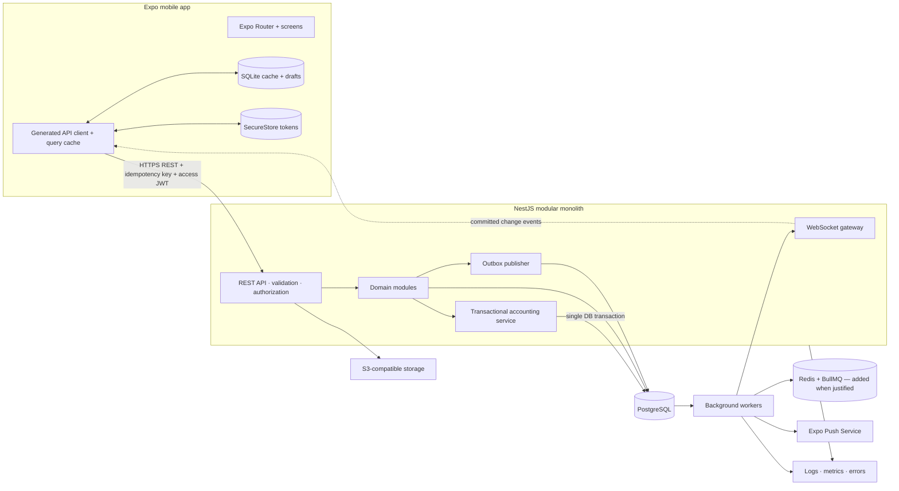
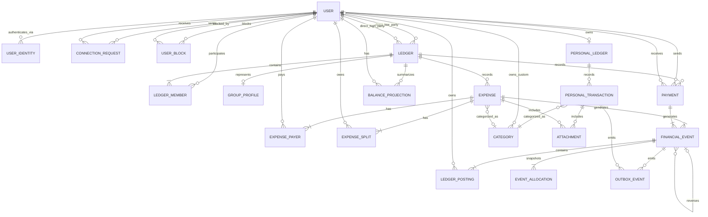

# Expense Sharing and Personal Finance — Project Specification

**Status:** Approved for implementation planning
**Date:** July 31, 2026
**Supersedes:** the open questions in [proposals/2026-07-31-expense-sharing-system-design-review.md](proposals/2026-07-31-expense-sharing-system-design-review.md). That proposal remains the design-rationale record; this document is the authoritative build spec.
**Target:** iOS and Android mobile application built with Expo.

---

## 1. Overview

A mobile-first application inspired by Splitwise. Two product areas:

1. **Shared expenses** — friends and groups track who paid, who owes, and settle up. The app records debts and settlements; it never moves money.
2. **Personal finance** — an individual manually records income and expenses and views spending reports.

The backend is a NestJS modular monolith over PostgreSQL. Financial correctness is enforced by an immutable event/posting ledger with a rebuildable balance projection. All architectural decisions below are finalized.

## 2. Product scope (v1)

### In scope

- Register, sign in, recover access, manage profile (password auth only in v1).
- Friend/connection requests: send, accept, decline, cancel, block.
- Groups: create, manage members and roles.
- Expenses: direct (with a friend) or in a group; **one or multiple payers**; splits **equal or exact-amount**.
- Balances per friend, per group, per currency.
- Edit/delete expenses without corrupting financial history.
- Record settlement payments; **overpayment allowed with a client-side warning**.
- Activity history and realtime updates via WebSockets; push reminders.
- Attach receipts/images to expenses and personal transactions.
- Personal income/expense entries with categories, notes, dates, sources, attachments.
- Personal reports: income, spending, net, category totals, monthly trends. Shared expenses contribute the **user's owed share by default (toggleable to cash-out-of-pocket)**.

### Out of scope (v1)

- Web client.
- **OAuth / social login** (deferred; schema is prepared — see §12).
- Bank linking, transaction import, payment processing, custody of funds.
- Automated currency conversion (balances stay separated by currency).
- Full double-entry bookkeeping for personal finance.
- Budgets, savings goals, investments, net-worth reporting.
- Microservices, Kafka, event sourcing as infra requirements.
- Fully offline financial mutations (cached reads + local drafts only).

## 3. Finalized architectural decisions

Each decision is recorded with rationale, alternatives considered, and consequences.

| # | Area | Decision | Rationale / consequence |
|---|---|---|---|
| D1 | Expense edit history | **Immutable per-event allocation snapshots.** Each `financial_event` stores the payer/split breakdown that was effective for that version. | Full "who owed what, when" audit. Costs extra snapshot rows; edits never overwrite prior allocations. Alt rejected: mutate-in-place (loses breakdown history). |
| D2 | Personal reporting of shared spend | **Owed-share by default, user-toggleable to cash-out-of-pocket.** | Economic-consumption view matches most users' intent; toggle serves cash-flow thinkers. Two read paths to test. |
| D3 | Settlement overpayment | **Client warns, server allows.** A payment beyond the balance flips it to a credit. | Supports pre-payment/rounding without silent corruption. Server still validates parties, currency, positivity. |
| D4 | Debt simplification | **Read-time settle-up suggestions only.** Never mutates postings. `simplify_debts` is a display setting, computed per currency. | Keeps the immutable ledger authoritative; avoids the classic simplification-corruption bug. |
| D5 | Data-access layer | **Drizzle (SQL-first)** with hand-editable migrations; raw SQL for locking, `FOR UPDATE SKIP LOCKED`, and deferred triggers. | Full control over the constraints the financial core needs; typed queries. Alt rejected: Prisma (hides transaction/locking primitives). |
| D6 | Split methods (v1) | **Equal + exact only.** | Covers the majority of cases with a small, well-tested split engine. Percentage/shares are additive later. |
| D7 | Multiple payers | **Supported in v1.** | `expense_payers` + posting math already handle it; no schema debt. |
| D8 | Realtime | **Own NestJS WebSocket gateway, outbox-driven.** Pushes "what changed"; clients refetch authoritative state. | Aligned with domain events (not raw row changes); works with service-layer authz. Shared Redis adapter added when multiple socket-hosting instances exist. |
| D9 | Auth | **Own session layer**: short-lived access JWT + rotating refresh sessions; `user_identities` table maps identity providers to one `user_id`. v1 ships **password only**. | OAuth (Google/Apple) slots in later with no re-architecture. Self-hosted/managed Postgres (Supabase not used). |
| D10 | Account deletion | **Block until balances are settled or the user has left all ledgers, then anonymize to a tombstone** and offer data export. | Reconciles GDPR erasure with the immutable ledger; counterparties' history stays valid. |
| D11 | Event ordering | **Order events by `(created_at, id)`.** No gapless per-ledger counter. | Rebuild sums all postings regardless of order; avoids per-ledger write serialization. |
| D12 | Zero-value postings | **Stored.** | Uniform audit output and participation queries; no special-casing. |
| D13 | Authorization | **NestJS service layer; no Postgres RLS.** Mobile never touches Postgres directly. | Single place for membership/role invariants alongside accounting logic. |
| D14 | File storage | **S3-compatible object storage (AWS S3 / Cloudflare R2)** with short-lived signed upload/download URLs. | Portable, cost-flexible; independent credentials/signing. |

**Carried over from the approved proposal:** integer minor-unit money with ISO 4217 codes; multi-currency balances kept strictly separate (no auto-conversion); financial mutations require connectivity; idempotency keys on **all** mutations plus optimistic `version`; transactional outbox from v1 (Redis/BullMQ added when throughput/retry needs justify); Expo Push for notifications and reminders.

## 4. Technology stack

**Mobile (Expo / React Native / TypeScript)**
- Expo Router for navigation.
- TanStack Query (candidate) for server-state caching and invalidation.
- Expo SQLite for cached reads and local drafts.
- Expo SecureStore for access/refresh tokens.
- Generated TypeScript API client from the backend OpenAPI document.

**Backend (Node.js / NestJS / TypeScript)**
- REST API with OpenAPI docs.
- Drizzle ORM + Drizzle Kit migrations (hand-editable SQL).
- PostgreSQL 14+ (managed, e.g. Neon/RDS/Fly — host chosen at deploy time).
- Separate NestJS worker process for the outbox and background jobs.
- Redis + BullMQ introduced when scheduled work / throughput / retries justify it, and as the WebSocket fan-out adapter at multi-instance scale.
- S3-compatible object storage for receipts and profile/group images.
- Expo Push Service for notifications.

## 5. System architecture



**Deployment:** stateless NestJS API instance(s) + one outbox/background worker + PostgreSQL + object storage. Redis added when BullMQ or multi-instance socket fan-out is introduced. API and worker share the codebase/domain packages but run as separate processes.

## 6. Domain modules

- **Auth** — password credentials, access-token issuance, rotating refresh sessions, device/session revocation, recovery. Owns `user_identities` for future federation.
- **Users** — profile, preferences, default currency, timezone, account lifecycle.
- **Connections** — connection requests, accept/decline/cancel, blocking (`user_blocks`), and creation/archival of direct ledgers.
- **Ledgers** — shared ledgers, membership, roles/status, membership authorization.
- **Groups** — group profile/settings; membership is `ledger_members` (no second table).
- **Expenses** — descriptions, payer allocations, splits, categories, dates, edit/delete commands; delegates all postings to Accounting.
- **Payments** — recorded settlements between two ledger members (evidence money moved elsewhere).
- **Accounting** — immutable financial events, per-event allocation snapshots, signed postings, balance projections, reversal/replacement logic, monetary invariants. **Sole writer of balances.**
- **Personal Finance** — personal ledger and manual income/expense transactions; separate from the shared zero-sum posting system.
- **Activity / Notifications / Files** — activity feed, notification prefs + delivery, device tokens, reminders, receipts/attachments.

## 7. Data model

### 7.1 ERD



`FINANCIAL_EVENT`, `LEDGER_POSTING`, and `EVENT_ALLOCATION` are **append-only**. `EXPENSE`/`PAYMENT` header rows are mutable + versioned, but the money and the allocation-at-time-T are captured immutably by the accounting tables.

### 7.2 Key entities and constraints

Full DDL for canonical pair keys, CHECK constraints, and deferred triggers lives in the proposal's **§23**; this section states the finalized shape including changes from the decisions above.

**`users`** — `id UUID PK`, `email CITEXT UNIQUE`, `display_name`, `default_currency CHAR(3)`, `timezone`, `status` (`ACTIVE`/`DEACTIVATED`/`ANONYMIZED`), timestamps + `deleted_at`.

**`user_identities`** (new, D9) — `id UUID PK`, `user_id`, `provider` (`PASSWORD` in v1; `GOOGLE`/`APPLE` later), `provider_subject TEXT`, `password_hash TEXT NULL` (only for `PASSWORD`), timestamps. Unique `(provider, provider_subject)`; unique `(user_id, provider)`.

**`refresh_sessions`** — rotating refresh tokens; `token_hash` unique, `user_id` indexed, device metadata, `revoked_at`.

**`connection_requests`** — canonical unordered pair columns (`pair_low_user_id`/`pair_high_user_id` generated); `status` in `PENDING/ACCEPTED/DECLINED/CANCELLED` (no `BLOCKED`); partial unique on the pair where `PENDING`; `CHECK(sender <> receiver)`.

**`user_blocks`** — directional `(blocker_user_id, blocked_user_id)` PK; `CHECK` distinct; independent of request history.

**`ledgers`** — `type` `DIRECT`/`GROUP`, `status` `ACTIVE`/`ARCHIVED`, ordered party columns `direct_low_user_id`/`direct_high_user_id` (set only for `DIRECT`, `low < high`), partial unique on the pair where `DIRECT`. **No `last_sequence`** (D11).

**`ledger_members`** — `(ledger_id, user_id)` unique; `role` `OWNER`/`ADMIN`/`MEMBER` (roles meaningful only for `GROUP`); `status` `INVITED`/`ACTIVE`/`LEFT`/`REMOVED`; history retained; leave-then-rejoin reactivates the row.

**`group_profiles`** — `ledger_id PK`, `name`, `group_type`, `image_object_key`, `simplify_debts BOOLEAN` (display setting only, D4), timestamps. Exactly one per `GROUP` ledger.

**`expenses`** — `id`, `ledger_id`, `created_by_user_id`, `description`, `total_minor BIGINT`, `currency CHAR(3)`, `category_id NULL`, `occurred_at`, `status` `ACTIVE`/`DELETED`, `version INTEGER`, timestamps. `CHECK(total_minor > 0)`, currency-shape CHECK.

**`expense_payers`** — `(expense_id, user_id)` unique, `amount_minor`. Sum = `expenses.total_minor` (deferred trigger). These reflect the **current** version; historical versions live in `event_allocations`.

**`expense_splits`** — `(expense_id, user_id)` unique, `owed_minor`, `split_method` (`EQUAL`/`EXACT` in v1). Sum = `expenses.total_minor` (deferred trigger).

**`payments`** — `id`, `ledger_id`, `from_user_id`, `to_user_id`, `amount_minor`, `currency`, `occurred_at`, `status`, `version`, timestamps. `CHECK(from <> to)`, `CHECK(amount_minor > 0)`, currency-shape CHECK. Membership + currency-match enforced in Accounting; overpayment permitted (D3).

**`financial_events`** — `id`, `ledger_id`, `expense_id NULL`, `payment_id NULL`, `event_type` `CREATED`/`REPLACEMENT`/`REVERSAL`, `reverses_event_id NULL`, `created_by_user_id`, `created_at`. `CHECK(num_nonnulls(expense_id,payment_id)=1)`; reversal-shape CHECK; unique `reverses_event_id` where non-null. **Ordering by `(created_at, id)`** (D11).

**`event_allocations`** (new, D1) — immutable snapshot of the allocation effective for an event: `id`, `financial_event_id`, `user_id`, `role` (`PAYER`/`PARTICIPANT`), `amount_minor`, `split_method NULL`. Lets the app reconstruct the exact payer/split breakdown of any historical version. Unique `(financial_event_id, user_id, role)`.

**`ledger_postings`** — `id`, `financial_event_id`, `user_id`, `amount_minor` (signed: **+ owed to member, − owed by member**), `currency`. Unique `(financial_event_id, user_id)`. **Zero-value postings stored** (D12). Per event & currency, `SUM(amount_minor)=0` (deferred trigger).

**`balance_projections`** — `(ledger_id, user_id, currency)` PK, `net_minor BIGINT`, `last_financial_event_id`, `updated_at`. Performance projection; source of truth is `ledger_postings`; rebuildable.

**`personal_ledgers`** — `id`, `user_id UNIQUE`, `created_at`.

**`personal_transactions`** — `id`, `personal_ledger_id`, `type` `INCOME`/`EXPENSE`, `amount_minor`, `currency`, `category_id`, `description`, `merchant_or_source NULL`, `occurred_at`, `notes NULL`, `status`, timestamps. `CHECK(amount_minor > 0)`, currency-shape CHECK.

**`categories`** — `id`, `owner_user_id NULL` (NULL = system), `name`, `kind` `INCOME`/`EXPENSE`/`BOTH`, `icon_key`, `color_key`, `is_system`. Partial unique `(owner_user_id, name, kind)` for owned; partial unique `(name, kind)` for system.

**`attachments`** — `id`, `owner_user_id`, `expense_id NULL`, `personal_transaction_id NULL`, `object_key`, `content_type`, `size_bytes`, timestamps. `CHECK(num_nonnulls(expense_id, personal_transaction_id)=1)`.

**`outbox_events`** — `id`, `event_type`, `aggregate_type`, `aggregate_id`, `payload JSONB`, `available_at`, `attempt_count`, `processed_at NULL`, `last_error NULL`, `created_at`. Partial index on `available_at` where `processed_at IS NULL`.

**Supporting:** `idempotency_keys` (unique `(user_id, route_scope, idempotency_key)`), `activity_events`, `device_tokens` (unique `token`), `notification_preferences`, `user_preferences` (holds the personal-report mode toggle, D2).

## 8. Financial engine

### 8.1 Posting rule

For every participant in an expense: `posting = amount_paid − amount_owed`. Postings for a member with a zero result **are stored** (D12). Per financial event and currency, postings sum to zero.

Example — Ali pays $60 split equally with Ben and Sara:

| Member | Paid | Owes | Posting |
|---|---:|---:|---:|
| Ali | $60 | $20 | +$40 |
| Ben | $0 | $20 | −$20 |
| Sara | $0 | $20 | −$20 |

### 8.2 Splits (v1: equal + exact)

- **Equal:** distribute `total_minor` across participants; distribute the remainder minor units deterministically (e.g. first-N participants by stable user ordering get +1) so the sum is exact.
- **Exact:** client supplies each participant's `owed_minor`; server validates the sum equals `total_minor`.

Rounding and remainder logic is unit- and property-tested.

### 8.3 Multi-payer (D7)

`expense_payers` may contain multiple rows; `SUM(amount_minor) = total_minor`. Postings net each payer's paid vs owed.

### 8.4 Edit / delete via reversal + snapshots (D1)

- **Edit:** create a `REVERSAL` event negating the current active postings, then a `REPLACEMENT` event with new postings; snapshot the new payer/split allocation into `event_allocations`; update `expenses`/`expense_payers`/`expense_splits` to the new current version; apply deltas to `balance_projections`. Requires the last-known `version` (optimistic concurrency) **and** an idempotency key.
- **Delete:** soft-delete the header (`status=DELETED`) plus a `REVERSAL` event. History remains queryable. Same for payments.
- Because reversal postings cancel replacement postings arithmetically, `balance_projection = SUM(ledger_postings)` with **no active-filter** — this is what makes rebuild trivially correct.

### 8.5 Settlements & overpayment (D3)

Payment `from → to` for `amount`:

```
from posting: +amount   (owes less)
to   posting: −amount    (is owed less)
total:          0
```

Server validates both parties are ledger members, the currency matches the balance being settled, and `amount > 0`. **Overpayment is permitted**; the client surfaces a warning when `amount` exceeds the current outstanding balance, and the resulting balance may flip to a credit.

### 8.6 Debt simplification (D4)

A **read-only** computation over per-currency net balances that outputs settle-up suggestions (who should pay whom to minimize transfers). It never writes postings or projections. Exposed only when `group_profiles.simplify_debts` is true.

## 9. Balance projections & concurrency

- Projections update **synchronously in the same transaction** as the postings (read-your-writes for the response).
- Apply each posting as an **atomic delta upsert** (lost-update-safe under `READ COMMITTED`; see proposal §23.7). If explicit locks are also taken, acquire projection rows in a deterministic order (by `user_id`) to avoid deadlocks.
- A **reconciliation job** rebuilds `net_minor` from `ledger_postings` and alerts on any drift.

## 10. Personal finance & reporting (D2)

The personal activity feed is a read model:

```
manual personal entries
UNION ALL
current user's active shared expense splits
```

- Manual `INCOME` → income; manual `EXPENSE` → spending.
- Shared: default mode contributes the user's `expense_splits.owed_minor` to spending ("your share"); the alternate **cash-out-of-pocket** mode (per-user toggle in `user_preferences`) contributes `expense_payers.amount_minor` instead and treats unpaid share as a receivable.
- Recorded shared **payments** never count as income/spending.
- Reversed/soft-deleted shared expenses are excluded (filter `expenses.status='ACTIVE'`).
- Results stay separated by currency.
- **Double-count caveat:** a user manually logging the same item that is also a shared expense will be counted twice; the UI warns and does not auto-dedupe.

## 11. Transactional workflows

### Create expense (single transaction)
1. Authenticate, authorize (ledger membership), validate splits/payers.
2. Reserve/check idempotency key.
3. Insert `expense`, `expense_payers`, `expense_splits`.
4. Insert `financial_event (CREATED)`, `event_allocations` snapshot, `ledger_postings`.
5. Upsert `balance_projections` (atomic deltas).
6. Insert `activity_events` and `outbox_events`.
7. Commit → return expense + updated balances. Worker later delivers push/realtime.

### Edit / delete / payment / personal transaction
As described in §8.4–§8.5 and the proposal §12; all wrapped in one transaction, all emitting outbox + activity rows, all idempotent and (for edits) version-checked.

## 12. Auth & identity (D9)

- **v1:** email + password. `user_identities` holds a `PASSWORD` row with `password_hash` (Argon2id). Access = short-lived JWT; refresh = rotating opaque token (hash stored in `refresh_sessions`), enabling device revocation. Tokens live in SecureStore.
- **Deferred OAuth:** Google/Apple added as additional `user_identities` rows via NestJS Passport strategies + Expo `expo-auth-session` (PKCE). The backend verifies the provider and issues **its own** tokens; the ledger always references one stable `user_id`. No schema change required. Apple Sign-In becomes mandatory on iOS once any social login ships.
- Password recovery via time-limited, single-use reset tokens.

## 13. Authorization & security (D13)

- Mobile talks only to the NestJS API (never directly to Postgres); the service enforces all authorization — **no RLS**.
- Every ledger request verifies active or historically permitted membership.
- Only `OWNER`/`ADMIN` manage group membership/settings.
- Payers, split participants, and payment parties must belong to the ledger.
- Personal transactions are visible only to the owner.
- Receipt up/download via short-lived signed URLs (D14).
- Access tokens short-lived; rotating refresh in SecureStore.
- Rate-limit auth, connection requests, invitations, reminders.
- Structured audit logs for financial mutations and sensitive operations (see §15).
- Money as integer minor units + ISO 4217; no client-supplied balance is trusted.

## 14. Realtime, outbox & notifications

- **Outbox (v1):** domain change + `outbox_events` row committed together. A worker polls committed rows with `FOR UPDATE SKIP LOCKED`, delivers/enqueues side effects, records success or schedules retry. At-least-once delivery ⇒ every consumer is idempotent (dedupe on outbox event id). Dead-letter + alerting before production.
- **Realtime (D8):** the worker feeds committed change events to the NestJS **WebSocket gateway**, which pushes "what changed" to subscribed clients; clients refetch authoritative state. Socket subscriptions are authorized per ledger. A Redis adapter is added once multiple instances host sockets.
- **Push:** Expo Push Service for reminders/notifications, driven off the outbox; `device_tokens` are the destinations.

## 15. Account lifecycle & data protection (D10)

- **Deletion:** refused while the user has unsettled balances or active ledger memberships; the user must settle or leave first. Deletion then **anonymizes** the user (scrub PII, set `status=ANONYMIZED`, keep a tombstone `user_id`) so counterparties' financial rows stay valid. Financial history is never hard-deleted.
- **Export:** user can export their data (profile, ledgers they belong to, expenses/payments/personal transactions).
- **Attachments:** receipts may contain PII; deletion propagates to object storage; signed URLs expire.
- **Retention:** define windows for `outbox_events`/`activity_events`; archive/partition when volume justifies.

## 16. Invariants (enforcement ownership)

Row-local rules → PostgreSQL `CHECK`/`UNIQUE`. Cross-row totals/membership → Accounting service inside the transaction, backed by **deferred constraint triggers** as defense-in-depth. Full SQL in proposal §23.

```text
DIRECT ledger members                  = exactly 2            (deferred trigger)
GROUP ledger group profiles            = exactly 1
Expense total                          > 0                    (CHECK)
Sum of expense payer amounts           = expense total        (deferred trigger)
Sum of expense participant shares      = expense total        (deferred trigger)
Payers/participants/payment parties    = members of the ledger (service)
Payment parties                        = distinct             (CHECK)
Financial-event posting total          = 0 per currency       (deferred trigger)
Balance projection key                 = ledger+user+currency (PK)
Personal transaction amount            > 0                    (CHECK)
Personal transaction owner             = personal-ledger owner (service)
At most one DIRECT ledger per pair     = unique               (partial unique)
At most one PENDING request per pair   = unique               (partial unique)
An event is reversed at most once      = unique               (partial unique)
```

## 17. Indexing (initial set, validated against query plans)

- `ledger_members (user_id, status)` and `(ledger_id, status)`.
- `expenses (ledger_id, occurred_at DESC)` with active-status strategy.
- `payments (ledger_id, occurred_at DESC)`.
- `financial_events (ledger_id, created_at, id)` (ordering, D11).
- `ledger_postings (financial_event_id)` and `(user_id)`.
- `event_allocations (financial_event_id)`.
- `balance_projections (ledger_id, user_id, currency)` PK.
- `personal_transactions (personal_ledger_id, occurred_at DESC)` with active-status strategy.
- Partial `outbox_events (available_at)` where `processed_at IS NULL`.
- Uniques from §16 plus `idempotency_keys (user_id, route_scope, idempotency_key)`, `device_tokens (token)`, `refresh_sessions (token_hash)` + `(user_id)`, category partial uniques, attachment parent indexes.

## 18. API & consistency

- REST resources + domain commands; OpenAPI generates the typed Expo client.
- **All** mutations accept an idempotency key; the stored record returns the original outcome on retry, and a reused key with a different payload is rejected.
- Expense/payment edits use optimistic concurrency (`version` / `If-Match`).
- Isolation level chosen after concurrency testing; same-balance-row updates lock or serialize safely (§9).
- Financial writes require connectivity; the app caches reads and drafts but never computes authoritative balances.

## 19. Error handling

- Invalid split totals → validation error, nothing written.
- Non-members → authorization error revealing no ledger contents.
- Duplicate idempotency key (same meaning) → original outcome; different payload → rejected.
- Stale edit `version` → conflict.
- Transaction failure rolls back expense/postings/allocations/projections/activity/outbox together.
- Notification failure never rolls back a committed financial write; it retries via the outbox.
- Projection drift is detected and repaired by the reconciliation job.

## 20. Testing strategy

- **Unit:** split/rounding (equal + exact), single/multi-payer posting generation, zero-sum invariant, payment signs, reversal+replacement + allocation snapshots, personal-report classification (both modes). Property-based tests for arbitrary allocations/rounding.
- **Integration (real Postgres):** transaction rollback, concurrent writes to one ledger, idempotency, optimistic-concurrency conflicts, projection-rebuild equality, outbox polling/retry/concurrent workers, constraint & deferred-trigger behavior.
- **E2E:** direct expense → balances; group expense with multiple payers; edit/delete with correct reversal + snapshot; payment (incl. overpayment warning); connection acceptance creating a direct ledger; member removal preserving history; personal income/expense; personal report including the user's shared share exactly once; deletion blocked while balances open.

## 21. Scaling path

1. Optimize Postgres queries/indexes.
2. Add stateless API replicas.
3. Add Redis/BullMQ + multiple workers for async throughput; Redis adapter for socket fan-out.
4. Partition/archive old activity/outbox data.
5. Extract a service only when a measured operational/organizational boundary appears.

Postgres remains the financial source of truth throughout.

## 22. Suggested delivery phases

1. **Foundations:** auth (password), users, connections + direct ledgers, base schema + migrations + constraints/triggers, idempotency, outbox skeleton.
2. **Shared expenses core:** groups, expenses (equal + exact, multi-payer), accounting engine (events, allocations, postings, projections), balances.
3. **Settlements & edits:** payments (with overpayment warning), edit/delete via reversal+snapshot, activity feed.
4. **Realtime & notifications:** WebSocket gateway, Expo Push, reminders.
5. **Personal finance:** personal ledger, transactions, categories, reports (owed-share + toggle).
6. **Attachments & polish:** receipts (signed URLs), debt-simplification suggestions, account deletion/export, reconciliation job.

Percentage/share splits and OAuth are explicitly post-v1.
