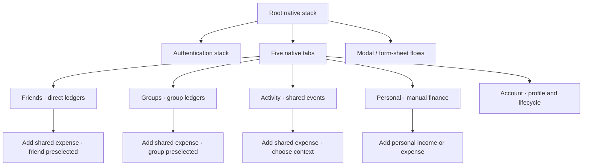
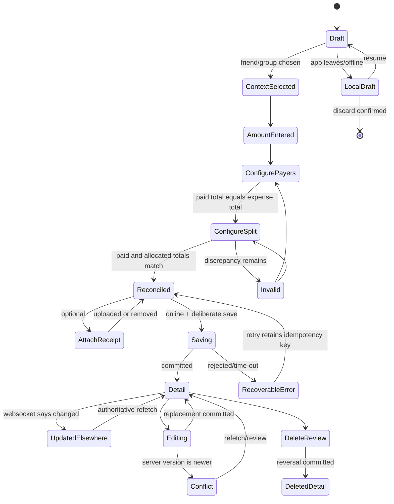
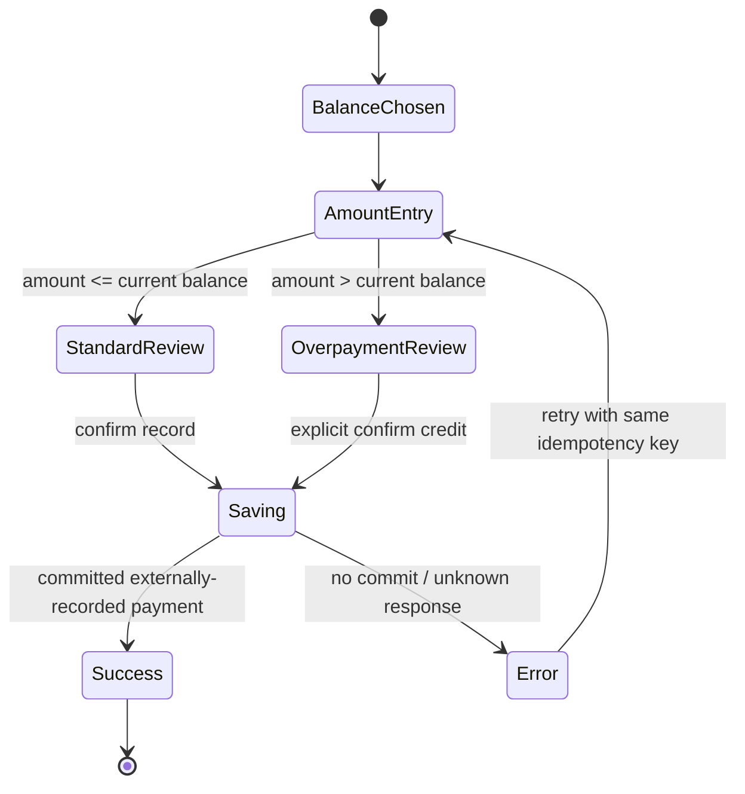
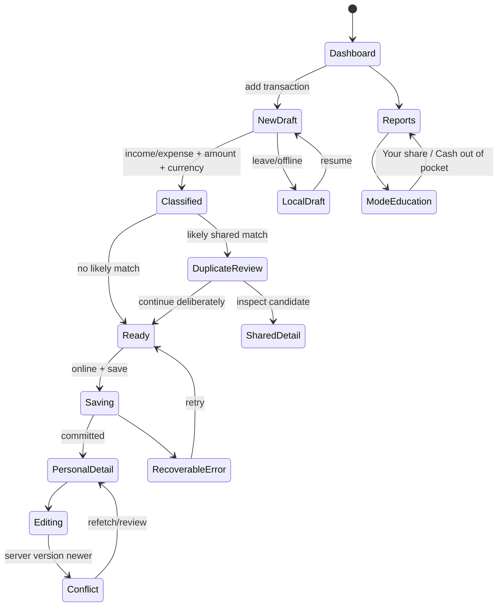

# Product contracts

Navigation, state machines, surface inventory, and the accessibility and financial-validation rules.
These are product-model contracts and are independent of visual styling.
Authority: [`../../architecture/2026-07-31-expense-sharing-project-spec.md`](../../architecture/2026-07-31-expense-sharing-project-spec.md)

---

## Surface inventory

The screen is the navigation unit. Sheets and dialogs are listed separately where they carry financial, permission, or destructive consequences. Every primary screen inherits the state contract at the end of this document.

### Authentication and profile setup

| ID | Surface | Key content and actions | Spec |
|---|---|---|---|
| A01 | Welcome | Product purpose; Sign in; Create account | §1, §2, §12 |
| A02 | Register | Name, email, password, password requirements, submit | §2, §12, §19 |
| A04 | Sign in | Email, password, recovery entry | §2, §12 |
| A05 | Request password reset | Email, neutral delivery confirmation | §12, §13, §19 |
| A06 | Set new password | New password, confirmation, expired-link state | §12, §13, §19 |

Email verification and a post-registration profile wizard are **not designed** — the register form collects
default currency and timezone directly. Register lands on the Friends tab.

### Friends and connections

| ID | Surface | Key content and actions | Spec |
|---|---|---|---|
| F01 | Friends | Direct balances grouped by currency; pending requests; Add connection; search | §2, §6, §8, §9 |
| F02 | Find/add connection | Search by supported identifier; invite or send request | §2, §6 |
| F03 | Incoming requests | Accept, decline, inspect identity | §2, §6, §13 |
| F04 | Sent request | Pending status; cancel request | §2, §6 |
| F05 | Friend ledger/profile | Explicit relationship balance; activity; Add expense; Settle up; reminder; settings | §2, §8, §14 |
| F06 | Friend settings | Relationship details; block. Nicknames and friend removal are unsupported | §2, §6, §13 |
| F07 | Block confirmation | Consequences, confirm, cancel | §2, §6, §13 |
| F08 | Blocked people | List and unblock action | §2, §6, §13 |

### Groups

| ID | Surface | Key content and actions | Spec |
|---|---|---|---|
| G01 | Groups | Group balance preview by currency; create group; search | §2, §6, §9 |
| G02 | Create group | Name, image, type, initial members | §2, §6 |
| G03 | Select/invite members | Search, selected count, pending/active state, invite link | §2, §6 |
| G04 | Group ledger | Group image/name; your balances by currency; expenses/payments; Add expense | §2, §8, §9 |
| G05 | Group balances | “You owe”/“owes you” rows per currency; settle entry; simplification entry | §8, §9 |
| G06 | Simplified debts | Read-only per-currency suggestions and non-mutation explanation | §8.6 |
| G07 | Group members | Active/pending members, roles, invite, remove | §2, §6, §13 |
| G08 | Group settings | Name/image/type, simplify preference, members, leave, delete if allowed | §2, §6, §13 |
| G09 | Change role / remove / leave | Consequence-specific confirmation and blocked conditions | §6, §13, §19 |

### Shared expenses and receipts

| ID | Surface | Key content and actions | Spec |
|---|---|---|---|
| E01 | Add shared expense | Explicit shared context; amount, description, currency, date; payer/split summaries; reconciliation; save | §8.1–§8.3, §11, §16, §18 |
| E02 | Choose ledger/participants | Direct friend or group context; search; confirmation | §2, §6 |
| E03 | Configure payers | One or many contributors; exact paid amounts; paid-total reconciliation | §8.3, §16 |
| E04 | Configure split | Equal/Exact only; participant inclusion; owed-total reconciliation | §8.2, §16 |
| E05 | Exact split | Exact minor-unit allocations and remaining amount | §8.2, §16 |
| E06 | Equal remainder explanation | Deterministic recipient and minor-unit remainder explanation | §8.2 |
| E07 | Currency picker | ISO code, currency name, recent/default choices | §3, §8 |
| E16 | Category picker | Expense-compatible categories with a selected state | §8.1 |
| E08 | Attach receipt | Camera/library actions, just-in-time rationale, denied-permission path | §2, §7, §13 |
| E09 | Receipt upload | Preview, progress, retry, replace/remove | §2, §11, §19 |
| E10 | Expense detail | Description/amount, payer and owed breakdown, receipt, audit/activity, edit/delete | §8.4, §14 |
| E11 | Edit expense | Latest version, change summary, reconciliation, review and save | §8.4, §9, §11 |
| E12 | Delete expense review | Financial consequence and immutable-history explanation | §8.4, §11, §19 |
| E13 | Deleted expense | Tombstone/detail with reversal context; no restore action | §8.4, §14 |
| E14 | Updated elsewhere | Nonblocking realtime notice and refresh action | §9, §14, §18 |
| E15 | Version conflict review | Newer authoritative version, review/refetch, discard or reapply manually | §9, §18, §19 |

### Settlements and reminders

| ID | Surface | Key content and actions | Spec |
|---|---|---|---|
| S01 | Choose balance | Counterparty and currency-specific balance | §8.5 |
| S02 | Record settlement | Direction, amount, date/note; “records money paid elsewhere” disclosure | §8.5, §11 |
| S03 | Overpayment review | Current balance, entered amount, resulting credit; deliberate confirm | §8.5, §19 |
| S04 | Settlement success/detail | Recorded event, resulting balance, audit context | §8.5, §14 |
| S05 | Reminder review | Recipient, relationship/currency balance, editable message if allowed | §2, §14 |
| S06 | Reminder result | Sent success or rate-limit feedback | §14, §19 |
| S07 | Payment detail | From/to, amount, currency, date, status/version, balance context; edit/delete | §8.5, §14 |
| S08 | Edit payment | Current values and financial consequence; save changes. Provisional contract | §8.5, §11 |
| S09 | Delete payment review | Amount, parties, reversal consequence; confirm/cancel | §8.5, §19 |

### Activity and search

| ID | Surface | Key content and actions | Spec |
|---|---|---|---|
| Y01 | Activity | Chronological actor/action/context feed; new/updated indicators; deep links | §2, §14 |
| Y02 | Activity search | Query, type/context filters, chronological results | §14 |
| Y03 | Realtime refresh | “Updated elsewhere” banner; refetch and announce | §9, §14 |

### Personal finance

| ID | Surface | Key content and actions | Spec |
|---|---|---|---|
| P01 | Personal dashboard | Per-currency income, spending, net; recent manual transactions; add | §10 |
| P02 | Personal transactions | Manual entries by month/currency; search and filters | §10 |
| P03 | Add personal transaction | Explicit Personal context; income/expense, amount, category, description/source, date, notes, attachment | §2, §10, §11 |
| P04 | Possible duplicate review | Candidate shared expense and explain/continue actions; no automatic dedupe | §10, §19 |
| P05 | Personal detail | Transaction hierarchy, attachment, edit/delete | §10 |
| P06 | Edit personal transaction | Latest version and changed fields | §9, §10, §11 |
| P07 | Delete personal review | Reporting consequence and confirmation | §10, §19 |
| P08 | Personal reports | Per-currency income, spending, net, categories, monthly trend | §10 |
| P09 | Report-mode education | “Your share” versus “Cash out of pocket,” examples and apply | §3 D2, §10 |

### Account, privacy and lifecycle

| ID | Surface | Key content and actions | Spec |
|---|---|---|---|
| C01 | Account | Profile summary and settings hierarchy | §2, §12, §15 |
| C02 | Edit profile | Name, image, default currency, timezone | §12, §15 |
| C03 | Security | Change password, sessions/devices, sign out | §12, §13 |
| C04 | Notifications | Activity and reminder preferences; just-in-time system permission | §14 |
| C05 | Data export | Scope, request, processing, ready/error/expired states | §15 |
| C06 | Delete account eligibility | Blocking balances and memberships with routes to settle or leave | §3 D10, §15 |
| C07 | Delete account confirmation | Tombstone/anonymization explanation and deliberate confirmation | §15, §19 |

### Required state contract

Each primary surface is designed for these states, with inapplicable states explicitly marked during implementation:

| State | Required behavior |
|---|---|
| First-use / empty | Explain purpose and offer one relevant primary action. |
| Populated | Prioritize relationship, context and amount over decoration. |
| Loading | Skeleton matches final geometry; controls that could duplicate work are unavailable. |
| Recoverable error | Plain-language cause where safe, Retry, and retained user input. |
| Offline cached read | Timestamped “Saved on this device” status; no promise of freshness. |
| Local draft | Autosave locally; resume or discard; never present as committed. |
| Saving/uploading | Single in-flight submission, progress when measurable, cancel only where safe. |
| Success | Confirm what changed and expose the resulting balance/detail. |
| Permission denied | Explain manual/settings alternative without a dead end. |
| Updated elsewhere | Announce new data and refetch authoritative state. |
| Version conflict | Show newer version; review/refetch; never silently overwrite. |
| Destructive confirmation | Name the object and consequence; safe cancel; deliberate action label. |

---

## Navigation and state model

### Authenticated shell

The five tabs map directly to distinct user intents. The tab bar never becomes a create destination. Creation remains contextual so the user always knows which ledger will change.



#### Context-aware add rules

| Origin | Action label | Destination | Required context marker |
|---|---|---|---|
| Friends list | Add expense | Shared expense; choose friend/group | `Shared expense` |
| Friend ledger | Add expense | Shared expense; friend fixed initially | `Shared expense · {friend}` |
| Groups list | Add expense | Shared expense; choose group/direct | `Shared expense` |
| Group ledger | Add expense | Shared expense; group fixed initially | `Shared expense · {group}` |
| Activity | Add expense | Shared expense; choose context | `Shared expense` |
| Personal | Add transaction | Manual personal income/expense | `Personal` |
| Account | None | — | — |

Changing the selected context requires an explicit row action. The title, context pill, save label and success message all repeat whether the entry is Shared or Personal.

### Shared-expense state diagram



#### Reconciliation model

```text
expenseTotalMinor > 0
sum(payer.paidMinor) = expenseTotalMinor
sum(split.owedMinor) = expenseTotalMinor
```

Save is enabled only when all three statements are true, a ledger and currency are selected, required text is valid, and the device is online. Client previews never replace server-authoritative balances.

### Settlement state diagram



The review and success surfaces say that the app records a payment made elsewhere and does not transfer money.

### Personal-finance state diagram



### Back, deep-link and refresh behavior

- Native back returns to the originating ledger/tab; it never switches Shared to Personal.
- Activity and notification deep links open the referenced friend, group, expense, payment or reminder result after authorization.
- WebSocket messages say what changed; the client refetches. They never carry a new authoritative balance to be trusted directly.
- A stale financial editor shows the update notice before save. A rejected `version` becomes a conflict review rather than an overwrite.
- Signed-in root routes are protected. A revoked/expired session returns to Sign in after refresh-session handling, preserving only non-sensitive local draft material.

---

## Everyday-loop wireframes

The interactive wireframe is the authoritative low-fidelity artifact. It uses real labels and validation states so the flow can be tested without visual polish or production code.

### Shared everyday loop

| Step | Surface | Primary decision | Persistent safety cue |
|---:|---|---|---|
| 1 | Group ledger | Review “You owe” / “owes you” by currency and recent activity | Currency sections never merge |
| 2 | Add shared expense | Confirm group/friend context; enter description and amount | `Shared expense · Winter Trip` marker |
| 3 | Payers | Add one or multiple contributors and exact paid amounts | Paid total and exact remaining amount |
| 4 | Split | Choose Equal or Exact and participants | Allocated total; deterministic remainder copy |
| 5 | Review/save | Confirm Total, Paid and Allocated | Save disabled with discrepancy or offline |
| 6 | Expense detail | See payer/split breakdown and resulting activity | Audit/version context and edit/delete actions |
| 7 | Group balances | Choose a specific currency relationship | Plain-language debt direction |
| 8 | Record settlement | Enter externally transferred amount | App-does-not-move-money disclosure |
| 9 | Settlement result | Review partial/settled/credit result | New balance and recorded event |

### Personal everyday loop

| Step | Surface | Primary decision | Persistent safety cue |
|---:|---|---|---|
| 1 | Personal dashboard | Inspect one currency’s income/spending/net | Personal label; no shared-balance implication |
| 2 | Add transaction | Choose income/expense; amount, category and source | `Personal` marker and Personal save label |
| 3 | Possible duplicate | Compare a likely shared-expense match | Continue remains manual; no automatic dedupe |
| 4 | Personal detail | Confirm what entered reports | No relationship balance change language |
| 5 | Reports | Inspect category/month trends per currency | No combined cross-currency total |
| 6 | Report mode | Learn and choose Your share/Cash out of pocket | Definition and example before apply |

### Key wireframe anatomy

#### Shared expense editor

1. Native title and Cancel action.
2. Persistent context marker with an explicit Change action.
3. Amount-first editor with ISO currency.
4. Description.
5. Payer summary and split summary as separate rows.
6. Progressive rows: date, category, receipt, note.
7. Reconciliation panel: Total, Paid, Allocated and discrepancy.
8. One “Save shared expense” action.

#### Balance and settlement

1. Relationship wording above the amount.
2. One currency per section and settlement action.
3. Disclosure before amount confirmation.
4. Overpayment adds an inline warning; it does not replace the entire form.
5. Success states show the resulting balance rather than only “Done.”

#### Personal reports

1. Personal and currency context in the header.
2. Three facts: Income, Spending, Net.
3. Category totals with textual equivalents for any chart.
4. Monthly trend with exact values accessible outside the plot.
5. Report-mode control and education entry.

### Exception-state wireframe set

The selected high-fidelity direction must be propagated to these wireframes before production handoff:

- Add expense with paid-total mismatch.
- Add expense with allocated-total mismatch.
- Exact split with a one-minor-unit remainder.
- Multiple payers with one incomplete contribution.
- Offline local draft and online-required save.
- Receipt permission denied, uploading, failed and retry.
- Saved expense updated elsewhere.
- Edit rejected by optimistic version conflict.
- Delete review and deleted audit detail.
- Partial settlement, exact settlement and overpayment credit.
- Empty/loading/error/offline states for every tab.
- Possible duplicate personal transaction.
- Report-mode education and changed result.
- Account deletion blocked by balances/memberships.

---

## Accessibility and financial validation

### Accessibility annotations

| Element | Accessible contract |
|---|---|
| Tab | Label and selected state; badge has spoken meaning; order matches visual order |
| Balance statement | One phrase such as “You owe Sam, 24 US dollars”; never reads a bare signed number |
| Money input | Label, currency, entered value and error; decimal-keyboard fallback; does not suppress paste or external keyboard |
| Person amount row | “Ali, paid amount” or “Ali, owed amount”; value and inclusion state |
| Reconciliation | Group heading plus Total/Paid/Allocated; validation result announced politely when it changes |
| Primary save | Action-specific label; disabled state and adjacent reason available to accessibility services |
| Receipt upload | File name/preview label, percent or indeterminate state, Retry and Remove visible controls |
| Realtime banner | Live-region announcement; Refresh is visible and keyboard/switch reachable |
| Chart | Summary plus navigable textual category/month list with exact values |
| Destructive dialog | Initial focus on title; object/consequence read before actions; safe action first in traversal |

#### Platform and WCAG requirements

- iOS targets are at least 44×44 pt; Android targets are at least 48×48 dp.
- Content reflows through 200% font scaling with no clipped money, labels, errors or controls.
- Normal text contrast ≥ 4.5:1; large text and meaningful non-text UI ≥ 3:1.
- VoiceOver/TalkBack order follows the visible decision order. Native headings are exposed as headings.
- All gestures have visible alternatives. Swipe-to-delete may be supplemental, never exclusive.
- Focus, pressed, selected, disabled, loading and error states are visually and programmatically distinct.
- Validation, upload progress/completion, save success/failure and realtime updates are announced without repeatedly interrupting input.
- Reduced Motion and system appearance preferences are respected.
- Authentication allows password managers and paste; it does not introduce memory puzzles or block assistive input.

### Money model

- Parse localized input to integer minor units before calculations.
- Display with the currency’s minor-unit rules and ISO code when ambiguity is possible.
- Never use floating-point equality for a financial decision.
- Never combine currencies in a total. Each currency is a separate section and query.

### Expense validation

Given total `T`, payer contributions `P[i]` and owed allocations `S[i]`:

```text
T > 0
P[i] >= 0 and sum(P) = T
S[i] >= 0 and sum(S) = T
ledger, currency, description, date and at least two valid participants satisfy server rules
```

Save remains unavailable until every rule passes and connectivity is available. The UI names exact differences:

```text
paidDifference = T - sum(P)
splitDifference = T - sum(S)
```

Positive difference means “add”; negative difference means “remove.” Both currency and absolute amount are stated.

#### Equal split

For `n` selected participants:

```text
base = floor(T / n)
remainder = T mod n
```

Allocate `base + 1` minor unit to the first `remainder` members in a stable server-agreed ordering and `base` to the rest. The UI names the affected participant(s), for example: “The extra USD 0.01 goes to Ali so the total matches.” Reopening the same draft must not reorder the recipients.

#### Multiple payers

- “Paid” and “Owes” are separate section labels and never appear in the same unlabeled table column.
- A participant may pay zero and owe a share, pay and owe, or pay without owing where domain rules allow.
- Changing total, currency or participants triggers a preview recalculation and clear review state; it never silently commits.

### Settlement validation

- Amount is positive and tied to one counterparty and currency.
- Copy states: “This records money paid elsewhere. The app does not transfer money.”
- If amount exceeds the current balance, show:
  - Current balance.
  - Entered amount.
  - Resulting credit and who will owe whom.
  - A deliberate `Record and create credit` action.
- Warning is nonblocking. The server remains authoritative and may accept the overpayment.

### Edit, delete and concurrency

- Every edit sends the last observed version and an idempotency key.
- On conflict, retain the local draft, show that newer data exists and offer Review latest / Discard local changes. Reapplying is manual.
- Delete review names the expense, amount, currency and effect. Success opens the deleted audit detail.
- No restore action is presented in v1.

### Offline and unknown-result behavior

- Cached reads show when they were saved and that they may be out of date.
- Local drafts are labeled Draft on this device and expose Resume/Discard.
- Financial save controls say “Connect to save” while offline. A draft is not displayed in committed activity or balances.
- If a request times out after submission, the same idempotency key is reused while the client refetches status; do not invite a blind duplicate submission.

### Permission and privacy annotations

- Contacts, camera, photos and notifications are requested only after the user chooses the corresponding action and sees the purpose.
- Denial offers a useful alternate route: search manually, choose another attachment source, continue without a receipt, or open settings.
- Tokens live in SecureStore; cached financial data and drafts are minimized; sensitive values are omitted from logs.
- Push notifications and app-switcher previews avoid exposing amounts or relationship debt by default.
