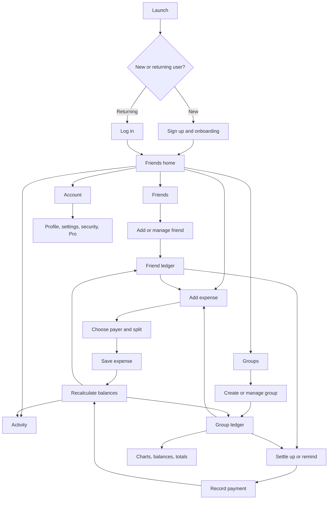

# Splitwise Clone — Current App Core Flows

## Purpose

This document extracts the product backbone represented by the screenshots in the [research gallery](../research/index.html). It describes what the current app does and how its journeys connect. It intentionally does **not** propose redesigns yet; it is the baseline for the next UI, UX, and visual-design brainstorm.

## Source and scope

- Source catalog: 55 iOS flows, 215 captured steps, and 158 unique screenshots.
- The catalog contains both end-to-end journeys and smaller subflows. Related captures have been consolidated below into 10 backbone flows.
- A user can split expenses directly with friends or inside a group.
- The app tracks obligations and recorded payments; it does not necessarily move money.
- Green values represent money the user is owed. Orange values represent money the user owes.

## Product model

The current app is built around five main objects:

1. **User** — an authenticated person with a profile, currency, security, notification, and subscription settings.
2. **Friend** — a person with whom the user can create non-group expenses and maintain a running balance.
3. **Group** — a shared context such as a trip, home, couple, or other collection of members and expenses.
4. **Expense** — a transaction with a description, amount, currency, date, payer, participants, split method, category, and optional group/receipt/note/repeat schedule.
5. **Payment** — a ledger entry that reduces or settles an existing balance. It records that money moved elsewhere; it does not itself transfer money.

The balance is calculated from expenses and payments:

`people + groups → expenses/payments → balances → settlement`

## App backbone at a glance

## Global navigation and shared behavior

The authenticated app has four persistent tabs:

- **Friends** — person-level balances and non-group expenses.
- **Groups** — group balances, group ledgers, and group management.
- **Activity** — a chronological feed of expense, payment, comment, and update events.
- **Account** — profile, preferences, security, integrations, subscription, and account controls.

Shared behavior across the app:

- A persistent **Add expense** action is available from the main tab views.
- Search is available from the top-level experience.
- Friend and group rows summarize the current balance before the user opens the full ledger.
- Friend and group detail screens combine a balance summary, quick actions, and chronological transaction history.
- Expense and payment changes feed back into Friends, Groups, Activity, charts, and totals.

Representative screen: [empty Friends home](../research/screens/d9db5584-a713-4d25-b5e4-b12ab226cfb2.jpg)

---

## Core flow 1 — Sign up, onboarding, and login

**User goal:** Enter the app with a usable identity and default currency.

### New-user path

1. Launch the app.
2. Choose **Sign up** from the entry screen.
3. Enter email address and password.
4. Confirm or change the default currency.
5. Enter full name and phone number.
6. Accept the terms and finish account creation.
7. View or skip the introductory product tour.
8. Land on the Friends home and begin by adding friends or an expense.

### Returning-user path

1. Choose **Log in**.
2. Enter email address and password.
3. Submit credentials.
4. Land in the authenticated app.

### Recovery path

1. Choose **Forgot your password?** from login.
2. Enter the account email.
3. Request the reset.
4. Follow the confirmation/recovery path.
5. Return to login with the new password.

**Connected captures:** Onboarding, Logging in, Resetting password.

Representative screens: [entry](../research/screens/70db38e6-dd65-499c-a58f-e611e1b06f2d.jpg), [sign-up credentials](../research/screens/8d6848dd-31ff-4a14-9774-7faa90646ac4.jpg), [profile and currency](../research/screens/4fc2caf1-b679-45bf-8147-b1aaabb12e18.jpg)

---

## Core flow 2 — Find, add, and manage friends

**User goal:** Establish the people with whom expenses and balances will be tracked.

### Add a friend

1. Start from **Add friends** on the Friends tab.
2. Search existing contacts or choose **Add a new contact to Splitwise**.
3. Enter the person's name and phone number or email address.
4. Review the contact and invitation destination.
5. Confirm **Add friends**.
6. Return to the Friends list with the new person available for expenses.

### Browse and manage friends

1. View the Friends list and overall owed/owing total.
2. Search or filter the list when needed.
3. Open a friend to see the combined balance and chronological ledger.
4. From the friend profile, add an expense, settle up, send a reminder, view charts, or open settings.
5. From settings, configure the relationship/default split, remove the friend, or block the user.

### Relationship states

- Active with a positive or negative balance.
- Settled up.
- Invited but not yet joined.
- Removed.
- Blocked, with management available through the blocklist.

**Connected captures:** Friends, Adding a friend, Filtering friends, Friend profile, Friend settings, Enabling default split, Sending a reminder, Removing a friend, Blocking a user, Manage blocklist.

Representative screens: [Friends list](../research/screens/0a8eddba-d95b-4087-9fa8-b0d973be600d.jpg), [add friend](../research/screens/1c683391-061f-46ec-af63-be129bb4783e.jpg), [friend profile](../research/screens/52b20eea-a570-4c21-b338-71e67b42081f.jpg)

---

## Core flow 3 — Create and manage groups

**User goal:** Create a durable shared space for members, expenses, balances, and settlement.

### Create a group

1. Start from **Create group** or **Start a new group** on the Groups tab.
2. Add a group image and name.
3. Choose a type: Trip, Home, Couple, or Other.
4. If it is a trip, optionally enable and set trip dates.
5. Save the group.
6. Arrive at an empty group detail screen.

### Add members

1. Choose **Add members** from the empty group or group header.
2. Select existing friends or add a new contact.
3. Review selected members.
4. Confirm the addition.
5. Alternatively, copy/share an invite link.

### Use and manage a group

1. Open a group from the Groups list.
2. Review the group-level balance summary and chronological expense/payment ledger.
3. Add expenses, settle up, or switch to Charts, Balances, or Totals.
4. Open group settings to manage identity, members, links, and balance behavior.
5. Optionally enable simplify debts, balance alerts, or settle-up reminders.

**Connected captures:** Groups, Creating a group, Group detail, Adding a member, Copying a link, Group settings, Turning on simplify debts, Enabling balance alert, Enabling settle up reminders.

Representative screens: [Groups list](../research/screens/8d4a1f26-0dd5-488c-a257-990a28c15159.jpg), [create group](../research/screens/ae237494-015c-4711-95ef-171f91f9a107.jpg), [empty group](../research/screens/7cdc0bfd-0fd8-4e34-8208-1761834fdfde.jpg)

---

## Core flow 4 — Add an expense

**User goal:** Record a shared cost and immediately update everyone's balances.

### Entry points

- Global **Add expense** action from a main tab.
- Add from a friend profile, which preselects that friend.
- Add from a group detail, which preselects the group and its members.

### Base path

1. Choose the people included in the expense.
2. Enter a description.
3. Enter the amount.
4. Confirm or change the statement **Paid by [person] and split [method]**.
5. Optionally change the date, group, category, currency, receipt, or note.
6. Optionally schedule the expense to repeat.
7. Save the expense.
8. Return to the relevant Friend/Group context with balances and Activity updated.

### Context variants

- **Non-group expense:** attaches directly to selected friends.
- **Group expense:** attaches to a group and selected group members.
- **Move/add to group:** an expense can be assigned to a group after participants are chosen.
- **Receipt-assisted expense:** import a receipt, inspect extracted line items/details, then finish the expense.

**Connected captures:** Adding an expense, Adding an expense (group), Adding a group, Changing a category, Changing a currency, Adding a note, Importing a receipt, Scheduling a repeat expense.

Representative screens: [expense form](../research/screens/7d5b695d-659f-4f8f-8a50-dc82651d79de.jpg), [choose group](../research/screens/73d31185-0d80-4c67-84c0-2472eef51c62.jpg), [saved state](../research/screens/d3239622-5eab-444d-a0f6-b7f8ad9f5393.jpg)

---

## Core flow 5 — Choose payer and split the expense

**User goal:** Accurately describe who paid and how much each participant owes.

### Payer path

1. Open the payer/split summary from the expense form.
2. Choose who paid.
3. Support one payer or, where available, multiple contributors.
4. Return to split configuration.

### Split path

1. Choose the included participants.
2. Choose a split method:
   - Equal shares.
   - Exact amounts.
   - Percentages.
   - Shares/units.
   - Adjustment-based split.
3. Enter or adjust the values for each participant.
4. Validate that the split accounts for the full expense amount.
5. Confirm and return to the expense form.

### Result

Saving produces individual obligations based on `payer contribution − assigned share`. These obligations roll up into friend balances, group balances, and totals.

**Connected captures:** Changing payer, Editing split options, Editing expense detail.

Representative screens: [split summary](../research/screens/836c3b1f-c0f0-47c4-8b2a-e5fa9f9f5c27.jpg), [split methods](../research/screens/a71f7dfa-24cd-4874-b5bd-1a3a3648ebc1.jpg)

---

## Core flow 6 — Review, edit, comment on, delete, and restore an expense

**User goal:** Understand and maintain the transaction after it has been recorded.

### Detail path

1. Open an expense from a friend ledger, group ledger, search result, or Activity.
2. Review description, amount, category, date, creator, payer, and participant obligations.
3. Review an attached receipt when present.
4. Add a comment or note.

### Edit path

1. Choose edit from expense detail.
2. Change base details, payer, participants, split, category, currency, receipt, note, group, or repeat schedule.
3. Save changes.
4. Recalculate all affected balances and surface the update in Activity.

### Delete and recovery path

1. Delete the expense from detail.
2. Show a deleted-expense state rather than losing all context immediately.
3. Choose restore when the deletion was accidental.
4. Reinsert the expense and recalculate balances.

**Connected captures:** Expense detail, Editing expense detail, Editing split options, Editing a receipt detail, Expense detail (deleted), Restoring an expense.

Representative screens: [expense detail](../research/screens/118a60b1-191b-460e-924d-2df50405bb46.jpg), [deleted expense](../research/screens/2b1a86c7-6122-40be-be7d-725a04ce24b8.jpg)

---

## Core flow 7 — Review balances and settle up

**User goal:** Understand who owes whom and close an outstanding balance.

### Review balances

1. See the overall amount owed or owing on Friends or Groups.
2. Open a friend or group to inspect its balance composition.
3. In a group, open **Balances** to see member-to-member obligations.
4. Optionally enable **simplify debts** to reduce the number of payments while preserving net balances.

### Settle up / record a payment

1. Choose **Settle up** from a friend or group.
2. Select the balance/currency to settle when multiple balances exist.
3. Choose or confirm payer and recipient.
4. Enter or confirm the payment amount.
5. Add payment details such as date or note if available.
6. Save the payment.
7. Show the payment detail and update the ledger and net balances.

### Important behavior

- The flow records a payment that happened outside the app.
- A partial payment reduces a balance; a full payment moves it to settled.
- Multiple currencies remain separate rather than being silently converted.

**Connected captures:** Group balances, Recording a payment, Turning on simplify debts, Sending a reminder.

Representative screens: [choose balance](../research/screens/f9ccb11d-e020-436f-9ed5-8caf559871f6.jpg), [recorded payment](../research/screens/fc8f407c-af7f-4f83-a480-c7c83b351f62.jpg)

---

## Core flow 8 — Activity, search, reminders, and purchase connection

**User goal:** Find what changed, locate records, and prompt people to resolve balances.

### Activity

1. Open the Activity tab.
2. Review a chronological feed of created/updated expenses, comments, and payments.
3. Open an event to reach the related expense, friend, or group context.

### Search

1. Open global search.
2. Enter a person, group, or expense-related query.
3. Select a result to open its detail context.

### Reminder

1. Open a friend with an outstanding balance.
2. Choose **Remind**.
3. Review or customize the reminder.
4. Send it and show confirmation.

### Connected purchases

1. Start from the Recent purchases area in Activity.
2. Choose **Connect an account**.
3. Complete the external account connection/permission path.
4. Return with purchases available to help create expenses.

**Connected captures:** Activity, Searching Splitwise, Sending a reminder, Connect to an account.

Representative screen: [Activity and recent purchases](../research/screens/cc189bd7-559f-4be6-b83b-97b3f67219ce.jpg)

---

## Core flow 9 — Group insights: charts, balances, and totals

**User goal:** Understand group spending beyond the transaction list.

### Insights path

1. Open a group.
2. Switch from the ledger to **Charts**, **Balances**, or **Totals**.
3. In Charts, inspect spending composition and select a chart view.
4. In Balances, inspect who owes whom.
5. In Totals, inspect total spend, personal share, amount paid, payments made, and change in balance.
6. Change the reporting period or use all-time data.
7. Open explanatory information for metrics when needed.

**Connected captures:** Charts, Chart view, Charts information, Group balances, Totals.

Representative screens: [group ledger and insight tabs](../research/screens/e0d16eba-18ae-4a6f-bd5a-0c7ac71d06c3.jpg), [totals](../research/screens/c8220cb5-942d-46c1-8a63-a594b97b0fe7.jpg)

---

## Core flow 10 — Account, preferences, security, and subscription

**User goal:** Maintain identity, app behavior, security, integrations, and plan.

### Account and preferences

1. Open the Account tab.
2. View or edit profile/account information.
3. Open account settings.
4. Change password, currency, or notification preferences.
5. Configure balance alerts and settle-up reminders where relevant.

### Security and access

1. Enable Face ID.
2. Confirm device authentication.
3. Use account settings to change password or recover access.

### Subscription

1. Open the Pro offer or subscription detail.
2. Review plan benefits and pricing.
3. Select a subscription option.
4. Confirm through the platform purchase flow.
5. Return with subscription status updated.

### Account closure

1. Open account settings.
2. Choose deactivate account.
3. Review consequences and confirm.
4. Complete deactivation and leave the authenticated experience.

**Connected captures:** Account, Account settings, Changing password, Customizing notifications, Enabling Face ID, Scanning a code, Subscribing to Splitwise Pro, Subscription detail, Deactivating account.

Representative screens: [Account](../research/screens/df8ee205-c7f1-4f2b-861b-7fb0c04e6e16.jpg), [account settings](../research/screens/7ae4a5e2-577d-4197-b598-55e6434929c6.jpg)

---

## System-wide state changes

These rules tie the flows together and are essential to the app backbone:

| User action | Records affected | Surfaces that must update |
| --- | --- | --- |
| Add/edit expense | Expense, participant shares, payer contributions | Friend/group ledger, balances, Activity, charts, totals |
| Delete expense | Expense status and calculated obligations | Detail state, ledger, balances, Activity, charts, totals |
| Restore expense | Expense status and calculated obligations | Detail state, ledger, balances, Activity, charts, totals |
| Record/edit payment | Payment and related balances | Friend/group ledger, balances, Activity, totals |
| Add/remove group member | Group membership and available participants | Group detail, add-expense participant list, group settings |
| Add/remove/block friend | Relationship state | Friends list, selectors, profile, blocklist |
| Enable simplify debts | Group settlement graph | Group balances and recommended payments |
| Change default currency | User preference | Future expense/payment defaults; existing records remain in their currencies |

## Empty, loading, confirmation, and exception states implied by the captures

The redesign should preserve these functional states even if their visuals change later:

- No friends yet.
- No groups yet.
- Empty group with no members or expenses.
- Friend/group is settled up.
- Invited friend has not joined.
- Expense saved confirmation.
- Payment recorded confirmation.
- Deleted expense with restore action.
- Search/filter with no matching result.
- Invalid or incomplete split.
- Multiple balances in different currencies.
- Permission/connection state for contacts, camera/QR, receipts, bank/purchase data, notifications, and Face ID.
- Loading and failure states for authentication, invitations, account connections, and subscription purchase.

## Complete 55-capture coverage map

This maps every named flow in the research gallery to the backbone flow above. “Supporting” means it is important but not a primary loop by itself.

| Capture in the research gallery | Backbone area | Role |
| --- | --- | --- |
| Account | 10 — Account/settings | Supporting |
| Account settings | 10 — Account/settings | Supporting |
| Activity | 8 — Activity/search | Core surface |
| Adding a friend | 2 — Friends | Core action |
| Adding a group | 4 — Add expense | Expense subflow |
| Adding a member | 3 — Groups | Core action |
| Adding a note | 4/6 — Expense lifecycle | Supporting |
| Adding an expense | 4 — Add expense | Primary loop |
| Adding an expense (group) | 4 — Add expense | Primary-loop variant |
| Blocking a user | 2 — Friends | Safety/supporting |
| Changing a category | 4/6 — Expense lifecycle | Supporting |
| Changing a currency | 4/6 — Expense lifecycle | Supporting |
| Changing password | 10 — Account/settings | Supporting |
| Changing payer | 5 — Payer/split | Core subflow |
| Chart view | 9 — Insights | Supporting |
| Charts | 9 — Insights | Supporting |
| Charts information | 9 — Insights | Supporting |
| Connect to an account | 8 — Activity/purchases | Optional integration |
| Copying a link | 3 — Groups | Member-growth subflow |
| Creating a group | 3 — Groups | Core action |
| Customizing notifications | 10 — Account/settings | Supporting |
| Deactivating account | 10 — Account/settings | Account lifecycle |
| Editing a receipt detail | 6 — Expense lifecycle | Supporting |
| Editing expense detail | 6 — Expense lifecycle | Core maintenance |
| Editing split options | 5 — Payer/split | Core subflow |
| Enabling balance alert | 3/10 — Groups/settings | Supporting |
| Enabling default split | 2/5 — Friends/split | Supporting |
| Enabling Face ID | 10 — Account/settings | Supporting |
| Enabling settle up reminders | 3/10 — Groups/settings | Supporting |
| Expense detail | 6 — Expense lifecycle | Core surface |
| Expense detail (deleted) | 6 — Expense lifecycle | Recovery state |
| Filtering friends | 2 — Friends | Supporting |
| Friend profile | 2/7 — Friends/balances | Core surface |
| Friend settings | 2 — Friends | Supporting |
| Friends | 2 — Friends | Primary surface |
| Group balances | 7/9 — Balances/insights | Core surface |
| Group detail | 3 — Groups | Primary surface |
| Group settings | 3 — Groups | Supporting |
| Groups | 3 — Groups | Primary surface |
| Importing a receipt | 4 — Add expense | Optional input method |
| Logging in | 1 — Authentication | Core entry |
| Manage blocklist | 2/10 — Friends/settings | Safety/supporting |
| Onboarding | 1 — Authentication | Core entry |
| Recording a payment | 7 — Settlement | Primary loop |
| Removing a friend | 2 — Friends | Relationship lifecycle |
| Resetting password | 1/10 — Authentication/settings | Recovery |
| Restoring an expense | 6 — Expense lifecycle | Recovery |
| Scanning a code | 10 — Account/settings | Optional utility |
| Scheduling a repeat expense | 4 — Add expense | Advanced expense option |
| Searching Splitwise | 8 — Activity/search | Supporting navigation |
| Sending a reminder | 7/8 — Settlement/activity | Supporting action |
| Subscribing to Splitwise Pro | 10 — Account/subscription | Monetization |
| Subscription detail | 10 — Account/subscription | Monetization |
| Totals | 9 — Insights | Supporting |
| Turning on simplify debts | 7 — Balances | Advanced balance option |

## Backbone priority for a future rebuild

This is a functional dependency order, not a redesign recommendation:

1. Authentication and basic profile.
2. Friends and groups.
3. Add expense with payer/split logic.
4. Friend/group ledgers and calculated balances.
5. Expense detail and editing.
6. Settle up and record payment.
7. Activity and search.
8. Group insights.
9. Settings, security, reminders, integrations, and Pro.

If flows 1–7 work coherently, the app has its complete everyday expense-sharing loop. Flows 8–10 deepen understanding, retention, safety, and monetization.

## Review prompts for the next brainstorm

Use these after confirming that this baseline is accurate:

- Which flows belong in the first version versus a later release?
- Should Friends or Groups remain the default home, or should balances/activity become the main dashboard?
- Where does the current app make the user choose too much before recording an expense?
- Which settings should move closer to the moment they affect?
- Which numbers and balance relationships need stronger visual explanation?
- Which flows need custom illustrations, data graphics, motion, receipt imagery, or richer empty states?
- What should feel meaningfully different from Splitwise instead of merely visually newer?
