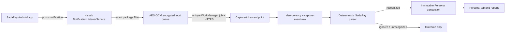
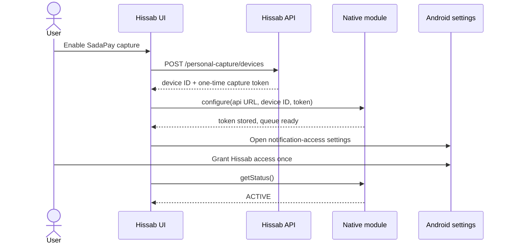
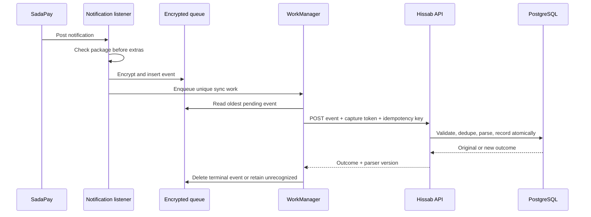

# Android SadaPay Automatic Personal-Transaction Capture

Status: Approved design; implementation not started  
Owner: Hissab  
Date: 2026-08-06  
Initial platform: Android only  
Initial source: SadaPay (`com.sadapay.app`) only

## 1. Decision

Hissab will offer an opt-in Android feature that watches SadaPay notifications and automatically records recognized financial events in the authenticated user's Personal ledger. After one-time setup, ordinary capture and synchronization require no human intervention.

The first version is deliberately narrow:

- Use Android's `NotificationListenerService` rather than a bank API, statement download, accessibility automation, email scraping, SMS forwarding, Tasker, or screen scraping.
- Accept notifications only from the exact SadaPay Android package, `com.sadapay.app`.
- Capture on the user's device, queue encrypted evidence locally, and synchronize it over HTTPS to that user's Hissab server.
- Parse deterministically on the server and create an immutable Personal transaction only when a notification matches a known rule.
- Store neither SadaPay credentials nor notification bodies on the server.
- Treat notification capture as best effort. It is automatic, but it cannot be represented as a complete bank feed or authoritative account statement.

This is not bank linking. Hissab does not authenticate to SadaPay, call private SadaPay APIs, initiate payments, or control the SadaPay app.

## 2. Main blocker and why this design is viable

The main blocker is not parsing or storage. It is obtaining a reliable transaction event without SadaPay cooperation.

SadaPay's statement flow requires a person to choose dates and download a file, and current-day and unsettled transactions may not appear in that statement. Android, however, exposes posted notifications to an explicitly approved `NotificationListenerService`. That makes notification capture the only practical, fully unattended hobby-project path after one-time OS permission.

The trade-off is unavoidable: Android may suppress notifications, the user may disable SadaPay alerts or Hissab's notification access, a work profile may hide them, OEM power management may delay work, and SadaPay may change its notification format. Therefore:

- automatic means no routine action after setup;
- it does not mean guaranteed completeness;
- Hissab must always label the source as notification-derived;
- Hissab must never present the Personal ledger as a bank statement or verified SadaPay balance.

## 3. Repository contract change required before implementation

The current `AGENTS.md` correctly says bank linking and transaction import are post-v1/out of scope and disallows queued automatic financial mutations. This approved design intentionally changes that scope for one narrow Android source.

Do not implement until the product owner accepts this replacement wording in `AGENTS.md`:

> Android-only automatic Personal transaction capture from supported banking-app notifications may be built when explicitly requested. It is opt-in, read-only, source-labelled, best effort, and must not use bank credentials, private bank APIs, accessibility automation, or payment execution. SadaPay is the only v1 source.

And add this exception to the financial-write rule:

> Canonical financial writes still require a network connection. Android notification evidence may be queued automatically in encrypted local storage and submitted later; it is not a financial record until the server validates it and creates an idempotent immutable Personal transaction. No other automatic or offline financial mutations are allowed.

Everything else in the repository contract remains unchanged, including five tabs, Personal/Shared separation, currency-neutral minor-unit money, idempotency, and auditability. Any source-currency text is ignored; the viewer’s Settings-only display preference selects the rendered symbol.

## 4. Scope

### Goals

- One-time setup: sign in, enable capture, approve Android notification access.
- Automatically capture supported SadaPay financial notifications even when Hissab's UI is closed.
- Retry synchronization after network or server outages without creating duplicates.
- Record recognized purchases, fees, cash withdrawals, transfers, income, and completed refunds in the Personal ledger.
- Ignore non-financial, failed, declined, pending-only, promotional, and OTP notifications.
- Categorize recognized expenses using Hissab's fixed system categories, defaulting to Other.
- Keep secrets and raw notifications under the self-hoster's control.
- Make parser behavior auditable with redacted examples and one runnable assertion-based check.

### Non-goals

- iOS.
- Any bank other than SadaPay.
- Downloading or reconciling account statements.
- SadaPay API integration, credential capture, PIN/OTP capture, reverse engineering, or app automation.
- Accessibility services, UI Automator, screen scraping, or rooted-device hooks.
- Transaction creation from SMS, email, screenshots, or receipts.
- Payment initiation or money movement.
- Guaranteed completeness, balance verification, or formal accounting reconciliation.
- Machine learning or an LLM in the transaction path.
- A generic bank-adapter interface before a second bank is approved.
- Automatically merging suspected duplicate transactions.
- Editing imported amount, direction, source, or occurrence time.
- Google Play distribution guarantees. Notification access may require additional policy work; sideloaded/self-built Android packages are the supported initial distribution.

## 5. Product semantics

### Financial event types

The current Personal transaction type only supports `INCOME` and `EXPENSE`. That is insufficient: moving money between a user's accounts is not income or an expense, and a refund should not inflate income.

Extend `personal_transaction_type` to:

- `EXPENSE`: completed purchase, bank fee, bill payment, or top-up.
- `INCOME`: completed incoming money that is genuinely income based on an explicit SadaPay notification rule.
- `TRANSFER`: completed incoming or outgoing transfer when Hissab cannot safely classify it as income or expense. Excluded from income/expense reports.
- `REFUND`: completed refund or authorization reversal. Excluded from income totals and shown separately.

Do not infer that every incoming transfer is income. Default ambiguous money movement to `TRANSFER`.

Treat an ATM withdrawal as a `TRANSFER` to cash, not an expense.

### Report behavior

- Expense totals include only `EXPENSE`.
- Income totals include only `INCOME`.
- Transfers and refunds have separate textual totals; transfers are excluded from income/expense calculations.
- Net expense is gross `EXPENSE` minus `REFUND`. The initial release does not link a refund to a specific expense or category because the notification may not provide a stable reference.
- Net Personal flow is `INCOME - EXPENSE + REFUND`; `TRANSFER` is excluded.
- Settlements remain excluded from Personal income and expense reports.
- Totals are currency-neutral and the frontend uses the viewer’s selected display symbol.

### Transaction lifecycle

- A capture event becomes a Personal transaction only after server validation.
- Imported financial facts are immutable in the initial release.
- Users may later edit category or notes only after the existing open product decision on Personal transaction concurrency is resolved.
- A failed or declined payment creates an `IGNORED` capture event, not a financial transaction.
- An unrecognized notification creates an `UNRECOGNIZED` capture event, not a guessed transaction.
- Duplicate evidence is recorded once and never auto-merged with an independently captured event.

## 6. Architecture



### Components

1. **Native Android listener**
   Receives posted notifications from Android. It checks `StatusBarNotification.packageName` before reading extras and returns immediately after writing a small encrypted local record.

2. **Encrypted local queue**
   Holds only pending capture evidence. A non-exportable Android Keystore AES key encrypts each payload with AES-GCM and a fresh nonce. The queue exists so capture survives process death and temporary network loss.

3. **WorkManager synchronizer**
   A single unique worker drains queued events in FIFO order whenever a network is available. WorkManager is the platform mechanism for persistent background work; no permanent foreground service is needed.

4. **Capture authentication endpoint**
   Uses a per-device, ingestion-only opaque token. The token cannot read user data, use normal authenticated APIs, or mutate Shared ledgers.

5. **Capture event service**
   Validates trust-boundary limits, enforces exact idempotency, runs the parser, and creates the Personal transaction in the same database transaction.

6. **Personal UI**
   Shows capture state and source-labelled transactions within the existing Personal tab. No sixth tab is added.

### Why parsing is server-side

The raw notification is transported only to the user's own Hissab server over HTTPS and is never persisted or logged there. Server-side rules are easier to update without rebuilding the Android app, share the same money/category constraints as canonical storage, and can atomically record both outcome and transaction.

On-device parsing is deferred. Add it only if a demonstrated privacy requirement outweighs the operational cost of shipping parser changes through Android builds.

## 7. Security and privacy model

### Explicit trust boundaries

- Android notification access is broad. The setup screen must say that Android grants visibility into notifications from other apps.
- Hissab discards every event whose package is not exactly `com.sadapay.app` before reading notification text.
- Hissab never opens, taps, dismisses, or modifies a SadaPay notification.
- Hissab never requests or stores SadaPay login credentials, card details, PINs, or OTPs.
- OTP and authentication notifications are rejected before persistence and never sent to the server.

### Device credential

- Generate a 256-bit random opaque capture token on the server.
- Return it once from device registration.
- Store only an HMAC-SHA-256 token hash in the capture-device credential row. The existing idempotency service may retain the encrypted registration response, including the one-time token, for its bounded retention window; it must never be stored unencrypted.
- Reuse the existing `OpaqueTokenService`; export it from `AuthModule` or move it to a small shared security module rather than duplicating token logic.
- Store the plaintext token encrypted with Android Keystore, not in AsyncStorage, TanStack Query, JavaScript logs, or Expo SecureStore from the background service.
- Scope the token to one user, one Android capture device, and event ingestion only.
- Permit one active capture device per user initially. Registering a new device revokes the old token.

### Data minimization

The native payload contains only:

- client-generated event UUID;
- package identifier;
- hashes of Android notification identity and normalized payload;
- posted/observed timestamps;
- title, text, expanded text, and text lines needed by parsing.

It must not contain notification icons, images, intents, remote views, device contacts, clipboard content, full device identifiers, SadaPay account credentials, or unrelated notification metadata.

### At rest and in transit

- Use HTTPS outside local development. The capture module refuses cleartext non-loopback URLs in release builds.
- Encrypt each local queue body with AES-256-GCM; keep the key non-exportable in Android Keystore.
- PostgreSQL stores parsed fields, hashes, outcome, and provenance—never the raw notification body.
- Application, reverse-proxy, error-reporting, and analytics logs must omit request bodies and authorization headers for the capture route.
- Successful and ignored events are removed from the device queue after the server acknowledges them.
- Unrecognized events remain encrypted locally for a bounded 30 days, are retried after parser-version changes, and are then deleted. Their server rows contain hashes and outcome only.

### Revocation and account lifecycle

- “Disconnect SadaPay capture” revokes the server token, removes the Keystore token and encryption key, and deletes the local queue after a native confirmation dialog.
- Password change and account deletion revoke all capture devices server-side along with sessions.
- When the app observes invalid authentication after sign-out/password change, it clears capture credentials and queued evidence locally.
- A lost or reinstalled device can be neutralized by registering a replacement device or revoking the active device from the Account/Personal settings screen.
- Rooted-device compromise, a malicious custom Android build, and a compromised self-hosted server are outside the protection boundary and must be stated in the open-source deployment guide.

## 8. Data model

Keep schema additions narrow and use database constraints at the trust boundary.

### `personal_capture_devices`

| Column | Type | Rule |
|---|---|---|
| `id` | UUID | primary key |
| `user_id` | UUID | user FK, not null |
| `token_hash` | text | HMAC-SHA-256 hex, unique, not null |
| `installation_id` | UUID | app-generated, not a hardware ID |
| `device_name` | text | user-visible Android model, bounded |
| `platform` | enum | only `ANDROID` initially |
| `last_seen_at` | timestamptz | nullable |
| `revoked_at` | timestamptz | nullable |
| `created_at` / `updated_at` | timestamptz | not null |

Only one non-revoked device is allowed per user. Enforce this with a partial unique index, not an application-only check.

### `personal_capture_events`

| Column | Type | Rule |
|---|---|---|
| `id` | UUID | primary key |
| `user_id` | UUID | user FK, not null |
| `device_id` | UUID | capture-device FK, not null |
| `client_event_id` | UUID | generated once on device |
| `source` | enum | only `SADAPAY_NOTIFICATION` initially |
| `source_event_key_hash` | char(64) | notification identity hash |
| `payload_fingerprint` | char(64) | normalized payload hash |
| `posted_at` | timestamptz | SadaPay notification post time |
| `observed_at` | timestamptz | Hissab listener observation time |
| `parser_version` | positive integer | rule set used |
| `outcome` | enum | internal `PROCESSING`, then `RECORDED`, `IGNORED`, `UNRECOGNIZED`, or `REJECTED` |
| `transaction_id` | UUID | nullable Personal transaction FK |
| `created_at` | timestamptz | not null |

Constraints:

- Unique `(device_id, client_event_id)` provides exact retry idempotency beyond the generic 24-hour idempotency claim window.
- Unique `(device_id, source_event_key_hash, payload_fingerprint)` deduplicates the same Android notification version even if it is assigned a new client UUID. The source hash includes package, Android notification key, and post time; a changed notification body has a different fingerprint and may be processed as a later status update.
- `transaction_id` is unique when present.
- `RECORDED` requires `transaction_id`; all other outcomes require it to be null. Insert `PROCESSING` to claim exact event identity, then transition it within the same DB transaction so a committed row never remains `PROCESSING`.
- Do not use `payload_fingerprint` alone to merge two events. It is diagnostic evidence only because legitimate repeated purchases can be identical.
- Raw notification text has no database column.

### `personal_transactions` additions

- Extend `personal_transaction_type` with `TRANSFER` and `REFUND`.
- Add `personal_transaction_direction` with `INFLOW` and `OUTFLOW`; backfill existing `INCOME` as inflow and `EXPENSE` as outflow. Require `INCOME`/`REFUND` to be inflow, `EXPENSE` to be outflow, and allow either direction for `TRANSFER`.
- Extend `category_kind` with `TRANSFER` and `REFUND` so required category references remain semantically correct.
- Add `source` enum: `MANUAL` or `SADAPAY_NOTIFICATION`, not null, default `MANUAL` for existing rows.
- Retain positive integer `amount_minor`, required category, description, merchant/source, occurred time, immutable audit behavior, and existing status fields.

### Categories

Reuse existing approved system expense categories for captured expenses:

- Food & Drink
- Groceries
- Transport
- Accommodation
- Utilities
- Entertainment
- Shopping
- Healthcare
- Other

Add only three Personal system categories needed to preserve semantics:

- `PERSONAL_TRANSFER` with kind `TRANSFER`.
- `PERSONAL_REFUND` with kind `REFUND`.
- `PERSONAL_OTHER_INCOME` with kind `INCOME`.

The Shared-expense API continues returning only system categories of kind `EXPENSE`, so these Personal-only categories cannot appear in or be attached to Shared expenses. Its nine approved categories remain unchanged.

## 9. API contract

All request/response DTOs belong in the backend OpenAPI definition. Regenerate the frontend client; never edit generated files.

### Register or replace a capture device

`POST /personal-capture/devices`

Authentication: normal access JWT  
Idempotency: required  
Effect: revoke any existing active capture device and return a new token once

Request:

```json
{
  "installationId": "ad8b33d6-d01a-41c7-815e-c6ad275491eb",
  "deviceName": "Pixel 9"
}
```

Response:

```json
{
  "device": {
    "id": "3d459860-2253-4c8b-9208-2c05536c91df",
    "platform": "ANDROID",
    "status": "ACTIVE",
    "lastSeenAt": null
  },
  "captureToken": "returned-only-once"
}
```

### Read capture status

`GET /personal-capture/device`

Authentication: normal access JWT  
Response: active device or `null`; never return token/hash.

### Revoke capture

`DELETE /personal-capture/device/:deviceId`

Authentication: normal access JWT  
Idempotency: required  
Response: `204`

### Submit an event

`POST /personal-capture/events`

Authentication: `Authorization: Capture <opaque-token>` through a route-specific guard  
Idempotency: required and set to `clientEventId` by the native worker  
Request body logging: disabled

Request limits:

```json
{
  "clientEventId": "e06190dc-6cf1-424a-bf6e-9b7a30105875",
  "sourcePackage": "com.sadapay.app",
  "sourceEventKeyHash": "64-lowercase-hex-characters",
  "payloadFingerprint": "64-lowercase-hex-characters",
  "postedAt": "2026-08-06T12:30:05.000Z",
  "observedAt": "2026-08-06T12:30:05.120Z",
  "title": "maximum 256 characters or null",
  "text": "maximum 2048 characters or null",
  "bigText": "maximum 4096 characters or null",
  "textLines": ["maximum 10 entries, 512 characters each"]
}
```

Response:

```json
{
  "eventId": "d1456413-d923-46ca-930a-42fc4db27d67",
  "outcome": "RECORDED",
  "personalTransactionId": "c75b010e-9614-43af-9651-7d88aa85294c",
  "parserVersion": 1
}
```

Validation:

- Reject any package other than `com.sadapay.app`.
- Reject missing/oversized fields and invalid UUID, timestamp, or hash shapes.
- Reject timestamps more than 24 hours in the future or more than 30 days old.
- Rate-limit by device token and IP.
- Treat a repeated `(device_id, client_event_id)` as success and return its original outcome.
- Treat a repeated `(device_id, source_event_key_hash, payload_fingerprint)` as the same Android notification version even when the client UUID differs.
- If and only if the stored outcome is `UNRECOGNIZED` and the current parser version is newer, reparse it and allow the one-way transition to `RECORDED`, `IGNORED`, or `REJECTED`. Terminal outcomes never change. The generic idempotency replay may return the cached old outcome until its 24-hour claim expires; the next scheduled retry then reparses.
- Create the capture-event row and Personal transaction in one PostgreSQL transaction.
- Use the existing integer minor-unit checks; do not persist or validate a source currency.
- Never echo notification text in an error.

### Personal reads

Implement the existing Personal transaction list/detail/report routes before replacing the Coming Later UI. The normal JWT-authenticated generated client is used for reads. Native background ingestion does not depend on JavaScript or the generated client.

## 10. Parser and categorizer specification

### Phase-zero evidence collection

Notification wording is not a public SadaPay API contract. Before production rules are written, build a development-only local diagnostic in the native module that shows the redacted fields captured from the developer's own SadaPay notifications. Tasker may be used once to compare what Android exposes, but it is not a runtime dependency or supported user flow.

Collect at least one redacted example of each available event:

- card purchase;
- online purchase;
- cash withdrawal;
- outgoing bank/Raast transfer;
- incoming transfer;
- bill payment or mobile top-up;
- fee;
- declined/failed payment;
- refund notification;
- authorization reversal;
- non-financial promotion;
- OTP/authentication notification.

Fixtures must replace names, account fragments, references, and merchants with synthetic values while preserving punctuation and field placement.

### Normalization

- Combine title, text, expanded text, and text lines in a fixed order.
- Apply Unicode NFKC normalization.
- Convert non-breaking spaces to ordinary spaces.
- Collapse whitespace without changing digits or punctuation.
- Compare status/direction keywords case-insensitively.
- Parse amounts using an explicit decimal-string routine into `bigint`; never use binary floating point.
- Ignore any currency spelling such as `PKR`, `Rs`, or `Rs.`; it must not affect the stored transaction or rendered symbol.
- Preserve the SadaPay-posted timestamp as `occurredAt`; store the device observation time separately on the capture event.

### Fail-closed rule order

Run rules in this order:

1. OTP, login, verification, card-number, and security content -> `REJECTED`; do not retain or retry.
2. Promotional/non-financial content -> `IGNORED`.
3. Failed, declined, canceled, or pending-only content -> `IGNORED`. In particular, SadaPay's current help article says its refund notification means the merchant initiated a refund, not that funds completed; that wording alone is pending and must not create a `REFUND` transaction.
4. Completed refund or reversal -> `REFUND`.
5. Completed outgoing or incoming account movement -> `TRANSFER`, unless an explicit rule proves genuine income.
6. Completed ATM withdrawal -> `TRANSFER`.
7. Completed purchase, fee, bill, or top-up -> `EXPENSE`.
8. Explicit completed income rule -> `INCOME`.
9. Anything else -> `UNRECOGNIZED`.

A rule returns a result only when status, amount, and direction are all unambiguous. There is no “closest match.”

### Categorization

Use one ordered list of explicit, reviewable merchant/notification patterns. Examples include:

- restaurant/cafe terms -> Food & Drink;
- supermarket/grocery terms -> Groceries;
- taxi/fuel/transit terms -> Transport;
- hotel/lodging terms -> Accommodation;
- electricity/gas/internet/mobile bill terms -> Utilities;
- cinema/game/streaming terms -> Entertainment;
- pharmacy/hospital/clinic terms -> Healthcare;
- general retail/e-commerce terms -> Shopping;
- unknown completed expense -> Other.

Do not create a categorizer interface, rule engine, or user-editable pattern system in the first implementation. One pure function and an ordered constant list are enough.

### Parser versioning

- Start at parser version `1`.
- Increment the integer when rules change in a way that can change outcomes.
- The server reports its current parser version in the event response and capture-status endpoint.
- A periodic worker retries locally retained `UNRECOGNIZED` evidence when the server parser version increases.
- Previously recorded transactions are never silently reclassified.

## 11. Runtime orchestration

### Enable capture



If native configuration fails, the newly registered token is immediately revoked. The UI does not claim Active until the token is stored and Android confirms listener access.

### Capture and synchronize



The listener performs no network I/O and no parsing. It minimizes main-thread work and delegates durable synchronization to WorkManager.

### Queue state machine

| Server/transport result | Local action | Retry |
|---|---|---|
| `RECORDED` | delete encrypted row | no |
| `IGNORED` | delete encrypted row | no |
| `REJECTED` | delete encrypted row; increment local diagnostic count | no |
| `UNRECOGNIZED` | retain encrypted row up to 30 days | daily and after parser-version increase |
| `400/422` | delete invalid row; increment diagnostic count | no |
| `401/403` | pause worker; show “Reconnect automatic capture” when Hissab next opens | after new token |
| `409` idempotency conflict | fetch/accept canonical event response if identifiers match; otherwise pause as configuration error | no blind retry |
| `429` | retain | server `Retry-After`, then backoff |
| network/`5xx` | retain | WorkManager exponential backoff |

Use one unique work name and `KEEP` policy so bursts do not create one worker per notification. The worker drains a bounded batch and reschedules if rows remain.

### Permission or service loss

- `getStatus()` compares configured credentials with Android's enabled notification-listener packages.
- The Personal screen shows `Permission required` immediately when the app is open and access is absent.
- Hissab cannot recover notifications that Android never delivered. It must show “Automatic capture paused since <time>” rather than implying the period is complete.

### Server outage

Capture evidence remains encrypted on device and synchronization resumes automatically. No canonical Personal transaction exists until an online server accepts the event. Queue limits are 1,000 events or 30 days, whichever comes first. If the limit is reached, delete the oldest evidence and expose a persistent data-loss warning; never silently overwrite.

## 12. User experience

Keep exactly five tabs. All work stays under Personal and Account.

### Personal root

Replace the current Coming Later state only when Personal list/report APIs contain real data. The root includes:

- currency-neutral Personal summary using the viewer’s display symbol;
- recent Personal transactions;
- source badge such as `SadaPay · Auto captured`;
- a compact automatic-capture status row;
- truthful empty and error states.

### Automatic capture screen

Suggested route: `/(tabs)/personal/automatic-capture`

States:

- **Not configured** — explanation and Enable action.
- **Permission required** — Open Android settings action.
- **Connecting** — device token registered, native setup pending.
- **Active** — access enabled; show last observed event, last successful sync, queued count, and unrecognized count.
- **Paused** — permission, credentials, or network/server issue; show reason in text.
- **Error** — terminal configuration failure with retry/disconnect actions.

Required copy:

> Hissab reads SadaPay notification text on this Android device to create Personal transactions. Other apps are ignored. Capture is automatic but may miss transactions if Android or SadaPay does not deliver a notification. Hissab never gets your SadaPay password or moves money.

Use a native confirmation dialog before disconnecting and deleting queued evidence. Preserve 48 dp Android touch targets, support 200% text scaling, and never communicate state by color alone.

## 13. Implementation guide

Implement in dependency order. Each phase must leave the repository valid; do not build speculative multi-bank abstractions.

### Phase 0 — approve contract and capture real formats

1. Apply the two `AGENTS.md` amendments from section 3.
2. Verify the installed official SadaPay package is `com.sadapay.app` on a development device.
3. Scaffold the local Expo module from `code/fe` as required by Expo's module tooling:

   ```bash
   CI=1 npx create-expo-module@latest --local --name hissab-transaction-capture --description "Android SadaPay notification capture for Hissab" --package expo.modules.hissabtransactioncapture
   ```

4. Rename the generated `modules/my-module` directory if the tool does not use the requested name.
5. Remove generated iOS, web, and native-view files. Set `platforms` to Android only in `expo-module.config.json`.
6. Add the temporary debug-only, locally visible field inspector and collect redacted samples from the developer's own device.
7. Commit only synthetic/redacted parser examples. Remove the raw inspector before release builds.

Stop if SadaPay does not emit parseable financial notification text. Do not replace this approach with accessibility automation.

### Phase 1 — schema and server primitives

Primary files:

- `code/be/src/database/schema/index.ts`
- generated migration under `code/be/drizzle/`
- `code/be/src/modules/auth/auth.module.ts` only if exporting `OpaqueTokenService`

Work:

1. Add capture device/event enums and tables.
2. Extend Personal transaction types and provenance.
3. Add the three Personal system categories through migration seed data.
4. Add FK, check, partial unique, and exact-idempotency constraints.
5. Generate the migration with the repository's Drizzle command; inspect generated SQL before applying it.

Do not add a mutable balance table, raw-payload column, generic adapter registry, or second token implementation.

### Phase 2 — backend capture module and Personal reads

Suggested directory:

```text
code/be/src/modules/personal-capture/
  personal-capture.controller.ts
  personal-capture.service.ts
  personal-capture.repository.ts
  personal-capture.dto.ts
  capture-token.guard.ts
  sadapay-parser.ts
  personal-capture.module.ts
```

Keep parser result types in `sadapay-parser.ts`; do not introduce an interface with one implementation.

Work:

1. Add register/status/revoke endpoints using normal JWT and existing idempotency patterns.
2. Add the route-specific Capture token guard.
3. Add event request validation with the exact limits from section 9.
4. Implement the fail-closed parser and categorizer as pure functions.
5. In one DB transaction: claim exact event identity, insert outcome, and insert the Personal transaction when recognized.
6. Add the module to `code/be/src/app.module.ts`.
7. Implement minimal Personal list/detail/report endpoints in a separate `personal-transactions` module only if the responsibility does not fit existing Personal code; none exists today.
8. Ensure API logging redacts the capture route body and `Authorization` header.
9. Revoke capture devices during password change and account deletion.

### Phase 3 — Android local Expo module

Expected module shape after deleting scaffold noise:

```text
code/fe/modules/hissab-transaction-capture/
  expo-module.config.json
  src/index.ts
  src/types.ts
  android/build.gradle
  android/src/main/AndroidManifest.xml
  android/src/main/java/expo/modules/hissabtransactioncapture/
    HissabTransactionCaptureModule.kt
    SadaPayNotificationListenerService.kt
    CaptureQueue.kt
    CaptureSyncWorker.kt
```

Use the Android library manifest so Gradle manifest merging adds the listener:

```xml
<service
  android:name="expo.modules.hissabtransactioncapture.SadaPayNotificationListenerService"
  android:exported="false"
  android:label="Hissab automatic transaction capture"
  android:permission="android.permission.BIND_NOTIFICATION_LISTENER_SERVICE">
  <intent-filter>
    <action android:name="android.service.notification.NotificationListenerService" />
  </intent-filter>
</service>
```

The Expo module exposes only:

- `configure({ apiUrl, deviceId, captureToken }): Promise<void>`
- `getStatus(): Promise<CaptureStatus>`
- `openNotificationAccessSettings(): Promise<void>`
- `disconnect(): Promise<void>`

Native implementation rules:

- Filter `sbn.packageName` before reading `Notification.extras`.
- Explicitly reject OTP/security notification channels or content.
- Read only title, text, big text, subtext if proven necessary, and up to 10 text lines.
- Generate `clientEventId` once; hash package + `sbn.key` + post time for source identity, and normalized content separately, with SHA-256.
- Copy only bounded fields in `onNotificationPosted`, then perform encryption and SQLite work on one native executor before scheduling synchronization; never parse or call the network on the listener callback.
- Encrypt with `AES/GCM/NoPadding` and a Keystore key created for encryption/decryption only.
- Use a small SQLite table through Android's built-in SQLite APIs; do not add a JavaScript database dependency.
- Enqueue one unique WorkManager request with a network constraint. Inspect the Android dependency graph first and add only `androidx.work:work-runtime-ktx` if WorkManager is not already available.
- Use platform HTTP primitives already available through Android/OkHttp transitively only if already present; otherwise `HttpURLConnection` is sufficient for this single JSON endpoint.
- Set connect/read timeouts and cap response bodies.
- Never log token, raw notification, ciphertext, or response body.
- Do not depend on the React Native bridge for background capture or upload.

The local module is auto-linked by Expo. A config plugin is unnecessary unless prebuild fails to merge the library manifest.

### Phase 4 — frontend orchestration

Primary areas:

- `code/fe/src/app/(tabs)/personal/`
- a small Personal capture hook beside existing feature hooks
- `code/fe/src/api/contracts.ts`
- `code/fe/src/api/generated/` regenerated, never hand-edited

Work:

1. Add the Automatic capture screen and status row.
2. Register the device through the generated API client.
3. Immediately pass the one-time token to the native module; never put it in query state.
4. If native configuration fails, revoke the just-created server device.
5. Open Android's notification-access settings and poll native status only while the screen is focused.
6. Use TanStack Query for server capture status and Personal reads.
7. On sign-out/password-change auth loss, call native disconnect/credential clear.
8. Replace Coming Later only when all visible controls and API paths work with real data.

### Phase 5 — parser check and end-to-end hardening

Add one runnable assertion script, not a test framework. Suggested command:

```json
"check:personal-capture": "node --experimental-strip-types scripts/check-personal-capture.ts"
```

It must assert, using redacted inline cases:

- one recognized expense with comma-separated PKR becomes exact minor units;
- one incoming transfer becomes `TRANSFER`, not `INCOME`;
- one declined payment is ignored;
- one OTP is rejected;
- one unknown format is unrecognized;
- the same event ID produces one transaction at the repository boundary check.

Wire the script into backend `verify` only after it is stable.

### Phase 6 — open-source packaging and rollout

1. Document notification-access setup, HTTPS requirement, reverse-proxy log redaction, backups, token revocation, and limitations.
2. Add a redacted parser-contribution guide.
3. Run a private self-hosted beta with one device before claiming general SadaPay support.
4. Publish supported SadaPay notification shapes and parser version, not raw examples.
5. Add a second bank only through a separate approved spec after observing that source's actual notification behavior.

## 14. Verification

### Automated repository checks

Backend:

```bash
cd code/be
pnpm verify
pnpm check:personal-capture
```

Frontend:

```bash
cd code/fe
pnpm api:generate
pnpm type-check
pnpm lint
pnpm check:refresh
```

Native build:

```bash
cd code/fe
pnpm prebuild
pnpm android:rebuild
```

Inspect the merged Android manifest and verify exactly one Hissab notification-listener service is present with `exported=false` and `BIND_NOTIFICATION_LISTENER_SERVICE`.

### Manual Android matrix

Verify on at least one stock Android device/emulator and the actual target phone:

- Hissab foreground, background, process killed, device locked, and after reboot.
- SadaPay package notification and an unrelated app notification.
- Online delivery and offline capture followed by automatic reconnect.
- Duplicate listener callback and duplicate HTTP retry.
- Permission removed and restored.
- Capture token revoked, replaced, and expired by password change.
- Server `400`, `401`, `429`, `500`, timeout, and malformed response.
- Queue at capacity and evidence at 30-day expiry.
- Recognized purchase, transfer, fee, decline, refund, OTP, and unknown wording.
- Amounts with commas, decimals, zero, and excessive values.
- Device timezone changes and timestamps around midnight.
- App sign-out, app data clear, uninstall/reinstall, and replacement device.
- Text scaled to 200%, screen reader labels, and no color-only state.

### Data/security inspection

- Search server, proxy, and device logs for fixture notification text and tokens; expect no matches.
- Confirm PostgreSQL has hashes/outcomes but no raw notification body.
- Confirm queued rows are ciphertext and cannot be read without the Keystore key.
- Confirm a repeated client event and the same notification version with a new client UUID both return the original result and one transaction row.
- Confirm identical legitimate purchases with different event IDs remain separate.
- Confirm Personal transactions never enter Shared activity or balances.
- Confirm reports are currency-neutral, exclude `TRANSFER`, show gross refunds separately, and subtract `REFUND` in net-expense/net-flow calculations.

## 15. Acceptance criteria

The feature is complete only when all are true:

1. An authenticated Android user can enable capture with one Hissab action and one Android permission grant.
2. A supported completed SadaPay notification received while Hissab is not open creates exactly one source-labelled Personal transaction without further user action.
3. Notifications from every other package are discarded before their text is read.
4. Offline evidence synchronizes automatically when connectivity returns.
5. Retries and duplicate callbacks never create duplicate transactions.
6. Failed, declined, pending, OTP, and promotional notifications do not create financial transactions.
7. Unknown wording fails closed and is never guessed into the ledger.
8. Money is stored as currency-neutral integer minor units.
9. Transfers and refunds do not inflate Personal income/expense reports.
10. Raw notification bodies and capture tokens do not appear in logs or canonical tables; the only allowed token copy outside the device is the existing idempotency service's encrypted, expiring registration response.
11. Revocation prevents subsequent ingestion and clears device secrets.
12. The UI truthfully reports permission loss, paused capture, queue overflow, and best-effort completeness.
13. Existing Shared ledgers, five-tab navigation, auth/session behavior, and generated-client rules remain intact.
14. All repository verification commands and the parser assertion check pass.

## 16. Operational behavior and observability

Collect only privacy-safe operational signals:

- active/revoked device count;
- last-seen and last-successful-sync timestamps;
- counts by outcome, parser version, and HTTP status class;
- queue count and oldest age on device;
- parser rule identifier, never raw input.

Do not add a third-party analytics SDK for this feature. Standard application metrics are enough. An increase in `UNRECOGNIZED` outcomes after a SadaPay release is the signal to update redacted fixtures and parser rules.

## 17. Open-source contribution and security rules

- Contributors must submit synthetic or irreversibly redacted notification examples.
- Pull requests containing real names, account numbers, references, tokens, notification screenshots, or transaction histories must be rejected and purged from Git history.
- No contribution may add SadaPay credentials, OTP handling, private endpoints, certificate bypasses, accessibility automation, or payment actions.
- Parser changes require incrementing the parser version and updating the one runnable check.
- Security reports should describe the issue without attaching live financial data.
- Fork maintainers are responsible for HTTPS, secret rotation, database access, backups, log retention, and Android signing keys. Open source makes code auditable; it does not make a deployment secure by itself.

## 18. Deliberate simplifications

- One active Android capture device per user. Add multiple devices only after a real use case appears.
- One SadaPay parser and one ordered categorizer function. Add an adapter abstraction only with the second approved bank.
- Server-side parser only. Add signed on-device rule bundles only if release latency becomes a measured problem.
- Poll capture status while its screen is focused. Add native event streaming only if polling causes a visible problem.
- Retain unrecognized encrypted evidence for 30 days. Add statement reconciliation only if a lawful, reliable, automated source becomes available.

These choices keep the security-critical path small without weakening validation, durability, or auditability.

## 19. Rejected alternatives

| Alternative | Rejection reason |
|---|---|
| Manual statement download | Not automated; excludes current-day and unsettled activity according to SadaPay's help article. |
| Automating statement UI with accessibility | Fragile, invasive, security-sensitive, and likely to break whenever SadaPay changes UI. |
| SadaPay partnership/API | Unavailable for the hobby/open-source constraint. |
| Reverse-engineered private API | Requires credentials/session material, breaks without notice, and creates unacceptable security and legal risk. |
| Tasker as the product | User-installed dependency and manual rule setup; acceptable only as a phase-zero diagnostic. |
| SMS/email parsing | Not known to provide the necessary SadaPay event coverage and expands sensitive-data access. |
| LLM parsing | Nondeterministic, expensive, hard to audit, and unsafe for exact money classification. |
| iOS notification capture | iOS does not expose another app's notifications to Hissab. |

## 20. References

- [Android `NotificationListenerService`](https://developer.android.com/reference/android/service/notification/NotificationListenerService)
- [Android persistent work and WorkManager](https://developer.android.com/develop/background-work/background-tasks/persistent)
- [Android Keystore system](https://developer.android.com/privacy-and-security/keystore)
- [Expo local native modules](https://docs.expo.dev/more/create-expo-module/)
- [Expo Modules API](https://docs.expo.dev/modules/module-api/)
- [Official SadaPay Android listing](https://play.google.com/store/apps/details?id=com.sadapay.app)
- [SadaPay account statement behavior](https://help.sadapay.pk/en/articles/7907996-account-statement)
- [SadaPay declined-transaction notifications](https://help.sadapay.pk/en/articles/8916525-how-to-prevent-declined-transactions)
- [SadaPay refund notification behavior](https://help.sadapay.pk/en/articles/13526032-understanding-refund-timelines)
